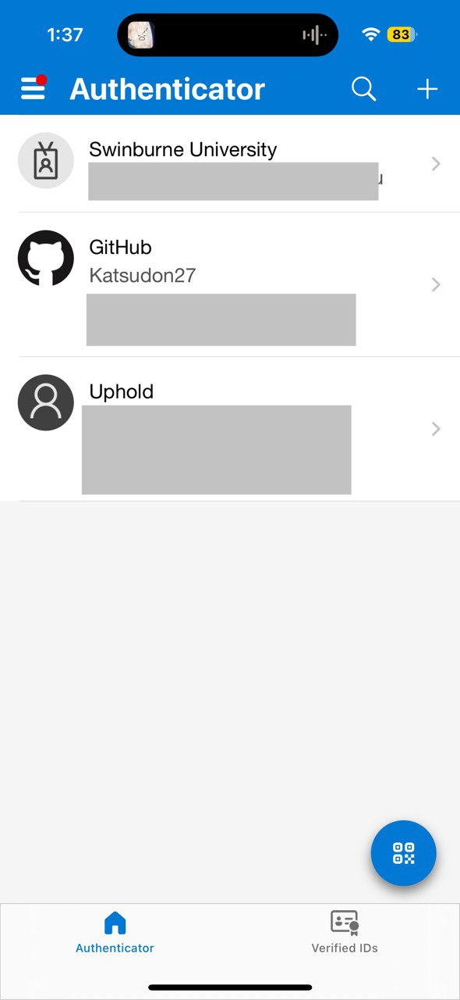
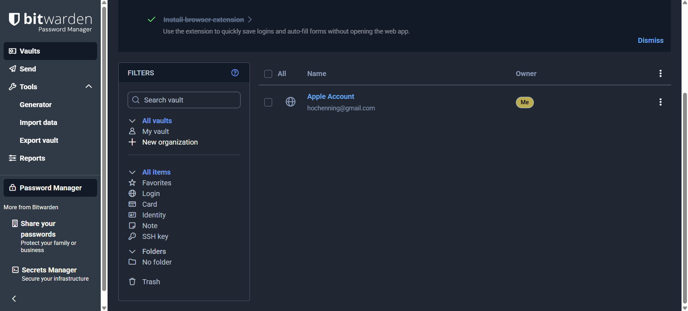
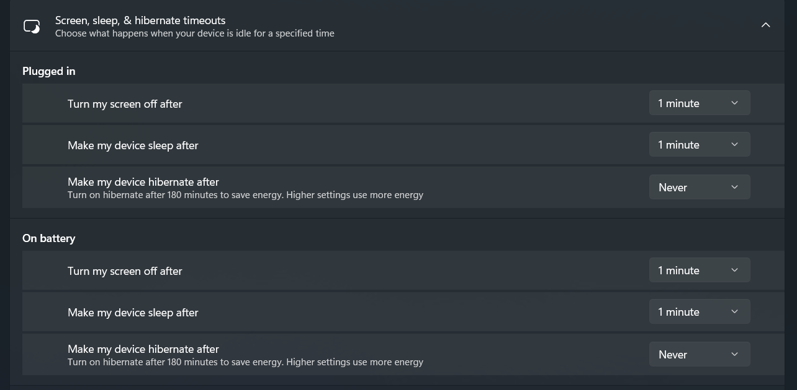
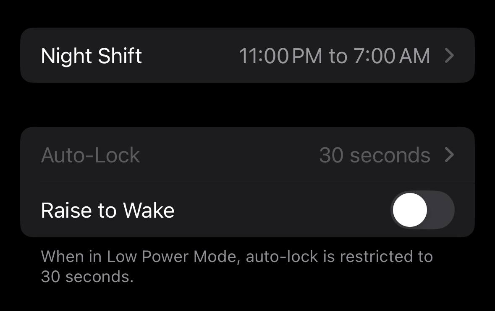

# 📝 Reflection

## What security measures do you currently follow, and where can you improve?

- Current security measures that I follow:
  - I use a password manager for my accounts.
  - I have enabled 2FA on my important services.
  - I also keep my system updated and auto-lock enabled.
- Areas of improvements
  - Avoid delaying software updates.
  - Report any suspicious activity quickly

## How can you make secure behaviour a habit rather than an afterthought?

- Configure automatic locking on my devices to ensure I do not forget the behaviour.
- Schedule monthly reviews of account security settings.

## What steps will you take to ensure your passwords and accounts are secure?

- Rotate passwords periodically.
- Enable 2FA wherever missing.
- Avoid password reuse completely.

## What would you do if you suspected a security breach or suspicious activity on your account?

- Immediately change the affected account password.
- Report the incident to the security or IT team.
- Run a full antivirus/malware scan.
- Enable/verify 2FA.

# Task

## Ensure your work accounts have strong passwords and enable 2FA where possible

- I have enabled 2FA for accounts like my Swinburne Student account and GitHub, using Microsoft Authenticator to generate unique, time-based one-time passcodes required for each login.
- Screenshot as proof:

## Review your password storage method—if you’re not using a password manager, consider setting one up

- I have set up Bitwarden as my password manager to store my accounts' passwords.
- Screenshot as proof:

## Set up your computer and phone to automatically lock (require a password or biometric login) if you are away for more than a few minutes

- I have set up automatic locks on both my computer and phone.
- On my computer, it will lock after 1 minute of inactivity as shown in the screenshot below.
- Screenshot as proof:

- On my phone, I have configured auto-lock after 30 seconds of inactivity as shown below.
- Screenshot as proof:

## Document one new cyber security habit you will follow at Focus Bear

- I will generate unique, random passwords via Bitwarden for every new account, and enable 2FA right after creation.

## Example of Security Habit in Action

- Last month, I received a suspicious login notification for my Google account from an unfamiliar IP address.
- Because I had 2FA enabled, the login attempt failed. I immediately reviewed recent activity logs, revoked the suspicious login attempt and changed my password.
- This experience encouraged me to regularly review account activity and keep my security settings up to date.
