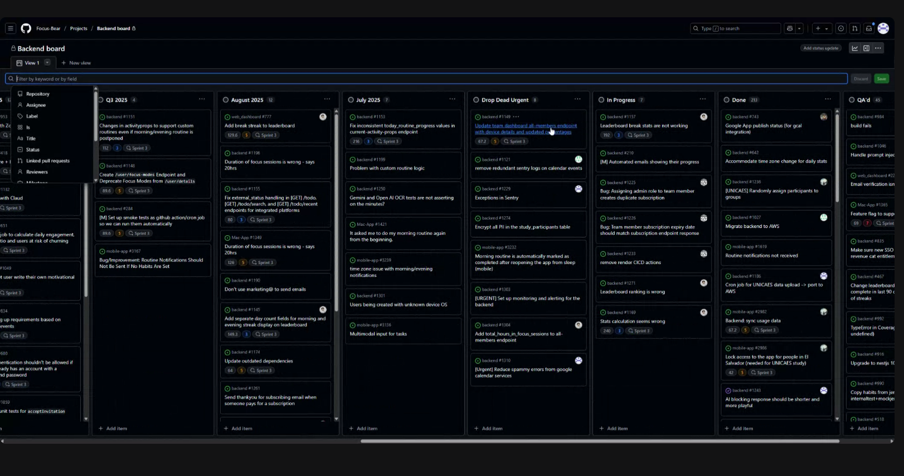
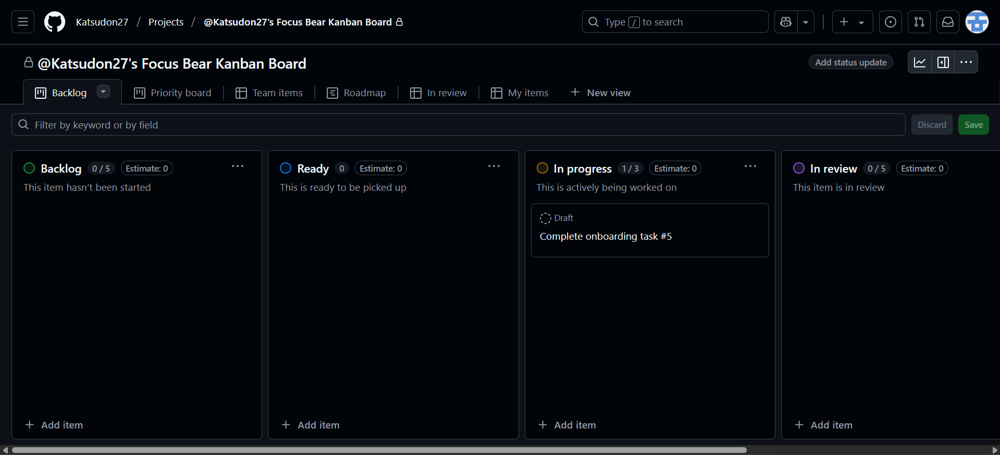

# 📝 Reflection

## How does Kanban help manage priorities and avoid overload?
- Kanban provides a visual overview of all tasks and their priorities, making it easier to choose the most important work first. 
- WIP limits ensure each team member focus on completing tasks before picking up new ones, which reduces the risk of burnout and missed deadlines.

## How can you improve your workflow using Kanban principles?
- Update task statuses immediately when progress changes
- Break down larger backend tasks into smaller cards for better tracking
- Regularly review the board to ensure my work aligns with the team’s current priorities.

# 🛠️ Task

## Check out Focus Bear’s Kanban board and note how tasks are structured. (Hint: Look in GitHub Projects.)
- I looked at Focus Bear's Kanban board in GitHub Projects during the daily stand-up meeting. The tasks are structured with past tasks grouped by month, and existing tasks grouped by their status such as Urgent, In Progress, or Done.
- Screenshot as evidence:
 

## Move at least one task through the Kanban process and update its status correctly.
- I managed to move the task "Complete onboarding task #5" through the Kanban process.
- I updated its status from Ready to In Progress. 
- I learned from moving the task that updating the task status right after completing the work can help to ensure the board reflects real-time progress.
- Screenshot as evidence:
 

## Identify one way you can improve task tracking in your role.
- Add more descriptive titles and acceptance criteria for my tasks so other team members can quickly understand what the tasks are about without needing extra clarification.