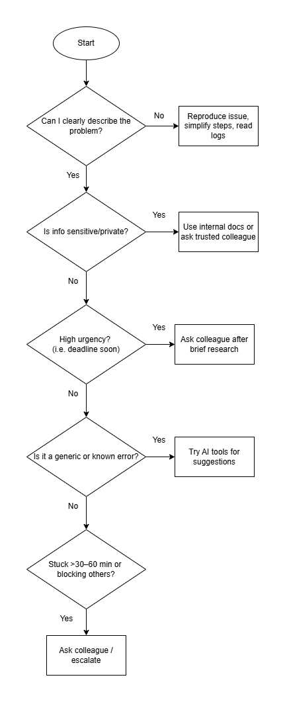

# When to Use Google, AI Tools, or Ask for Help?

## Tasks 

- I created a flowchart to outline scenarios where each resource would be most appropriate:

- I exported the flowchart and added it to this repo under the images folder in the folder "10 - Debugging".

## Reflection

### When do you prefer using AI vs. searching Google?

- I prefer to use AI when:
  - I need summaries or “explain like I’m 5” versions of docs.
  - Prototyping or generating boilerplate.
  - Comparing approaches quickly.
- I prefer to use Google when:
  - Searching for official docs, GitHub issues, or Stack Overflow threads.
  - Verifying AI-generated code against trusted sources.

### How do you decide when to ask a colleague instead?

- After 30–60 minutes with no progress using docs/search/AI.
- When the issue involves team-specific architecture or private systems.
- When a decision affects the whole project or needs alignment

### What challenges do developers face when troubleshooting alone?

- Tunnel vision whereby simple fixes are overlooked.
- Spending too much time on irrelevant leads.
- Risk of adopting bad practices from unchecked sources.
- Missing team knowledge or historical context.
