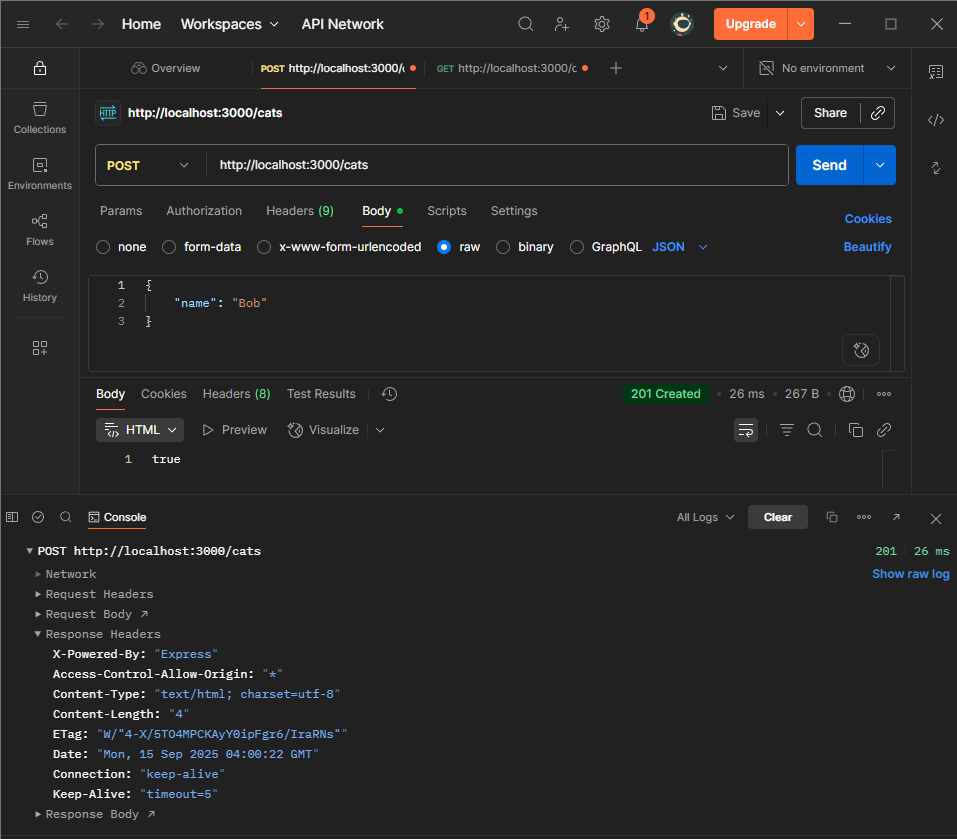
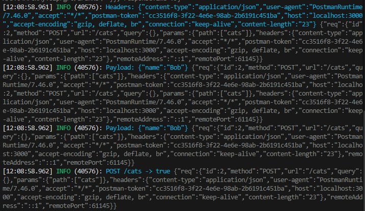

# Inspecting API Requests & Responses

## Task

- I modified cats.controller.ts to log request payloads and headers:
```ts
import { Controller, Get, Param, Post, Body, Logger, Req, Inject } from '@nestjs/common';
import { CatsService } from './cats.service';
import { CreateCatDto } from './dto/createCat.dto';
import { Logger as PinoLogger } from 'nestjs-pino';

@Controller('cats')
export class CatsController {
    constructor (private readonly catsService: CatsService,
        @Inject(PinoLogger) private readonly logger: PinoLogger
    ) {}

    @Get()
    getCats(){
        return this.catsService.findAll();
    }

    @Get(':id')
    getCat(@Param('id') id: string){
        return this.catsService.findOne(Number(id));
    }

    @Post()
    addCat(@Body() createCatDto: CreateCatDto, @Req() req: Request){
        this.logger.log(`Headers: ${JSON.stringify(req.headers)}`);
        this.logger.log(`Payload: ${JSON.stringify(createCatDto)}`);
        return this.catsService.addCat(Date.now(), createCatDto.name); 
    }
}
```

- I inspected API responses and verify HTTP status codes by sending a GET request to the modified endpoint using Postman:


- I added a logging.interceptor.ts to modify and analyze API responses
```ts
import { Injectable, NestInterceptor, ExecutionContext, CallHandler, Logger as NestLogger, Inject } from '@nestjs/common';
import { Observable, tap } from 'rxjs';
import { Logger } from 'nestjs-pino';

@Injectable()
export class LoggingInterceptor implements NestInterceptor {
  constructor(@Inject(Logger) private readonly logger: Logger) {}

  intercept(context: ExecutionContext, next: CallHandler): Observable<any> {
    const req = context.switchToHttp().getRequest();
    const method = req.method;
    const url = req.url;

    return next.handle().pipe(
      tap((data) => {
        this.logger.log(`${method} ${url} -> ${JSON.stringify(data)}`);
      }),
    );
  }
}
```

- I modified main.ts to use the created interceptor:
```ts
import { NestFactory } from '@nestjs/core';
import { AppModule } from './app.module';
import { ValidationPipe } from '@nestjs/common';
import { Logger } from 'nestjs-pino';
import { HttpExceptionFilter } from './common/filters/http-exception.filter';
import { LoggingInterceptor } from './common/interceptors/logging/logging.interceptor';

async function bootstrap() {
  const app = await NestFactory.create(AppModule, {
    bufferLogs: true,
  });
  app.useLogger(app.get(Logger));

  // Register global error filter
  app.useGlobalFilters(new HttpExceptionFilter());

  app.enableCors();
  
  app.useGlobalPipes(new ValidationPipe({ whitelist: true }));

  // Register the LoggingInterceptor globally
  app.useGlobalInterceptors(app.get(LoggingInterceptor));
  
  await app.listen(process.env.PORT ?? 3000);
}
bootstrap();
```

- Screenshot of the terminal showing the logged headers and payload as well as the API response from the interceptor:


## Reflection
### How can logging request payloads help with debugging?

- Shows the exact data your endpoint receives
- Helps confirm if validation errors are due to wrong payload or backend logic
- Useful for reproducing bugs from real client requests

### What tools can you use to inspect API requests and responses?

- Postman (UI client, easy to explore headers/body/status)
- Bruno (lightweight alternative to Postman)
- curl / httpie (CLI tools)
- Browser DevTools (for front-end calls)

### How would you debug an issue where an API returns the wrong status code?

- Reproduce the call in Postman
- Check server logs for thrown exceptions or custom status codes
- Verify controller decorators (@HttpCode, @Res) and global filters
- Add breakpoints or temporary console.log to trace code paths

### What are some security concerns when logging request data?

- Avoid logging sensitive data (passwords, tokens, PII)
- Sanitize logs before storing in production
- Restrict log access and rotate log files
