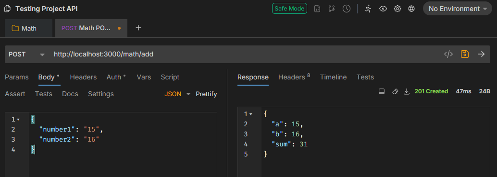
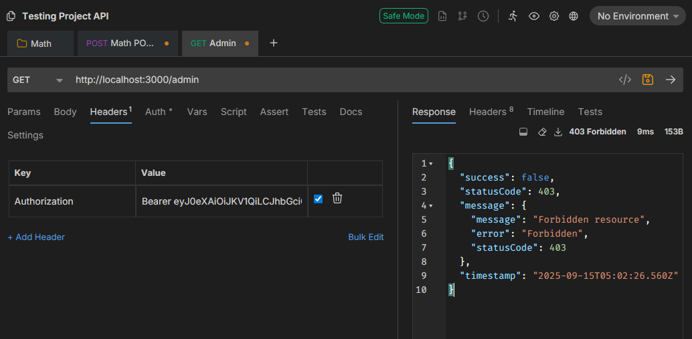

# API Debugging with Bruno

## Tasks

- I installed Bruno and created a new API collection called Testing Project API
- I manually added a tested a simple POST endpoint for my nestjs project by sending a POST request to http://localhost:3000/math/add using Bruno:

- I tested how authentication tokens can be passed in Bruno by adding a header to the request with Authorization as the key and the token as the Value:

## Reflection

### How does Bruno help with API testing compared to Postman or cURL?

- Lightweight and fast compared to Postman.
- Requests are saved as plain files, easy to version-control.
- Simpler than cURL with GUI and history without long terminal commands
- Perfect for developers who want minimal overhead.

### How do you send an authenticated request in Bruno?

- Open request, then at the Headers tab add a header with Authorization as the key and the token as the value.

### What are the advantages of organizing API requests in collections?

- Keeps endpoints grouped by feature (Users, Auth, Products).
- Easier collaboration by sharing of folder via Git.
- Quickly switch between environments (dev, staging, prod).

### How would you structure a Bruno collection for a NestJS backend project?

- Root: “Testing Project API”
  - Auth → login, signup, refresh
  - Users → list, details, update
  - Math (sample) → add, subtract
  - Admin → dashboards, settings
