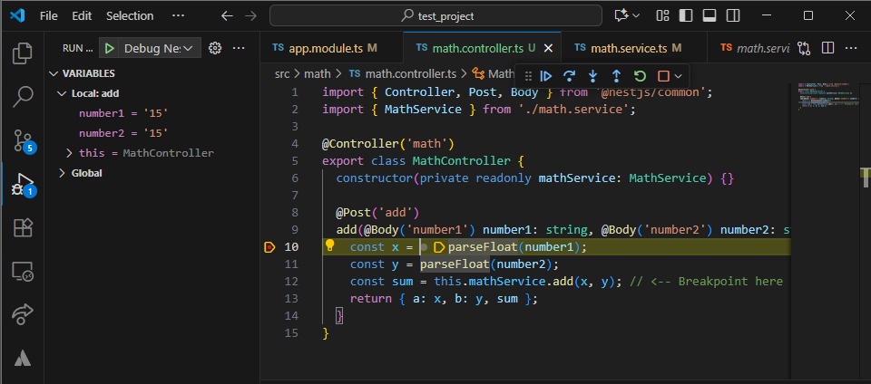
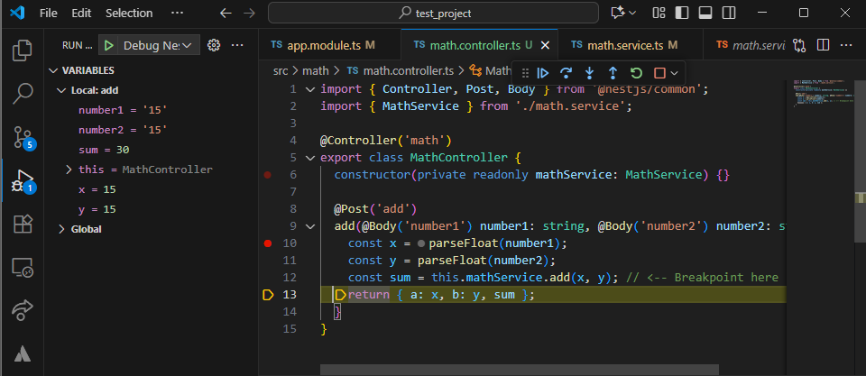

# Debugging with VS Code & Breakpoints

## Task

- I managed to set up a launch configuration (launch.json) for debugging
```json
{
  "version": "0.2.0",
  "configurations": [
    {
      "type": "node",
      "request": "launch",
      "name": "Debug NestJS App",
      "runtimeExecutable": "node",
      "runtimeArgs": ["--inspect", "-r", "ts-node/register", "src/main.ts"],
      "skipFiles": ["<node_internals>/**"],
      "restart": true,
      "console": "integratedTerminal"
    }
  ]
}
```

- I created a math.service.ts for subsequent testing:
```ts
import { Injectable } from '@nestjs/common';

@Injectable()
export class MathService {
  add(a: number, b: number): number {
    const result = a + b;
    return result;
  }

  divide(a: number, b: number): number {
    if (b === 0) throw new Error('Division by zero');
    return a / b;
  }
}
```

- I created a math.controller.ts for subsequent testing:
```ts
import { Controller, Post, Body } from '@nestjs/common';
import { MathService } from './math.service';

@Controller('math')
export class MathController {
  constructor(private readonly mathService: MathService) {}

  @Post('add')
  add(@Body('number1') number1: string, @Body('number2') number2: string) {
    const x = parseFloat(number1);
    const y = parseFloat(number2);
    const sum = this.mathService.add(x, y); // <-- Breakpoint here
    return { a: x, b: y, sum };
  }
}
```

- I placed breakpoints in both of the service and controller files to inspect response handing as shown in the following screenshot after running the Run and Debug feature from VS Code and sending a GET request using Postman:



- I then stepped through function execution and observe variable values by using F10/F11 key.


## Reflection

### How do breakpoints help in debugging compared to console logs?

- Pause execution exactly where you want.
- Inspect variables, call stack, and closures live.
- No need to restart the server after adding prints.
- Step through logic instead of scanning logs.

### What is the purpose of launch.json, and how does it configure debugging?

- Stores VS Code debug configuration for the project.
- Tells VS Code how to start or attach to Node (e.g., program, runtimeArgs).
- Allows breakpoints to map correctly to TypeScript via source maps.

### How can you inspect request parameters and responses while debugging?

- Put a breakpoint inside a controller method or service.
- Send a request from Postman; execution will pause.
- Hover over req.body, req.params, or service variables to inspect.
- Check return values or res.status() in the Variables pane.

### How can you debug background jobs that don’t run in a typical request-response cycle?

- Launch the worker script in debug mode using node --inspect-brk dist/worker.js.
- Use VS Code’s “Attach to Node Process”.
- Trigger the job manually if needed (e.g., via CLI or a queue message)
