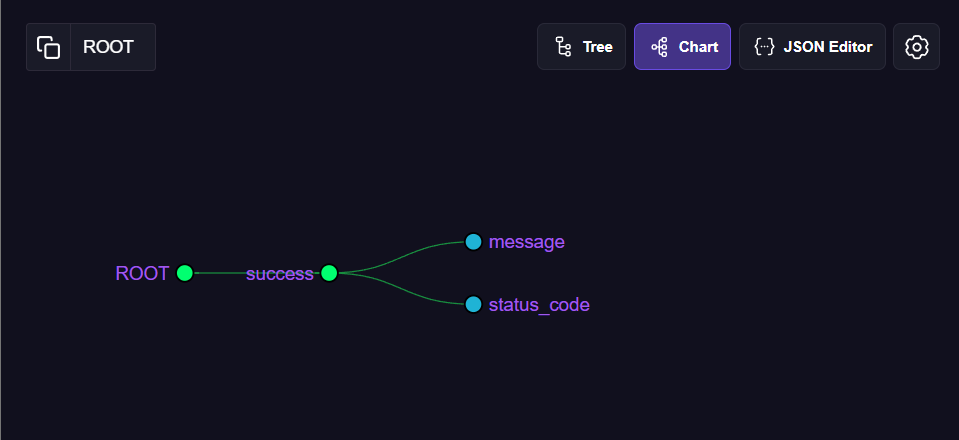

# Reflection

## Which extensions did you install? Why?

1. React Developer Tools - Allows me to inspect component tree, props and state for React apps.
2. Redux DevTools - Allows tracking and debugging of Redux store state changes over time.
3. JSON Viewer - Formats and color-codes JSON data directly in the browser, making API responses much easier to read when working on backend endpoints.
4. Lighthouse – Runs performance, accessibility, and audits to identify areas for improvement in web apps.

## What was the most useful thing you learned?

- While exploring JSON Viewer, While exploring JSON Viewer, I discovered that it not only color-codes JSON but also lets me navigate the structure of a response from the root object down to nested keys such as success, message, and status_code through its Chart feature.
- This hierarchical view makes it much easier to trace through large, nested API responses, which will be especially helpful when debugging backend features.
- Screenshot of JSON Viewer's Chart feature as evidence:

