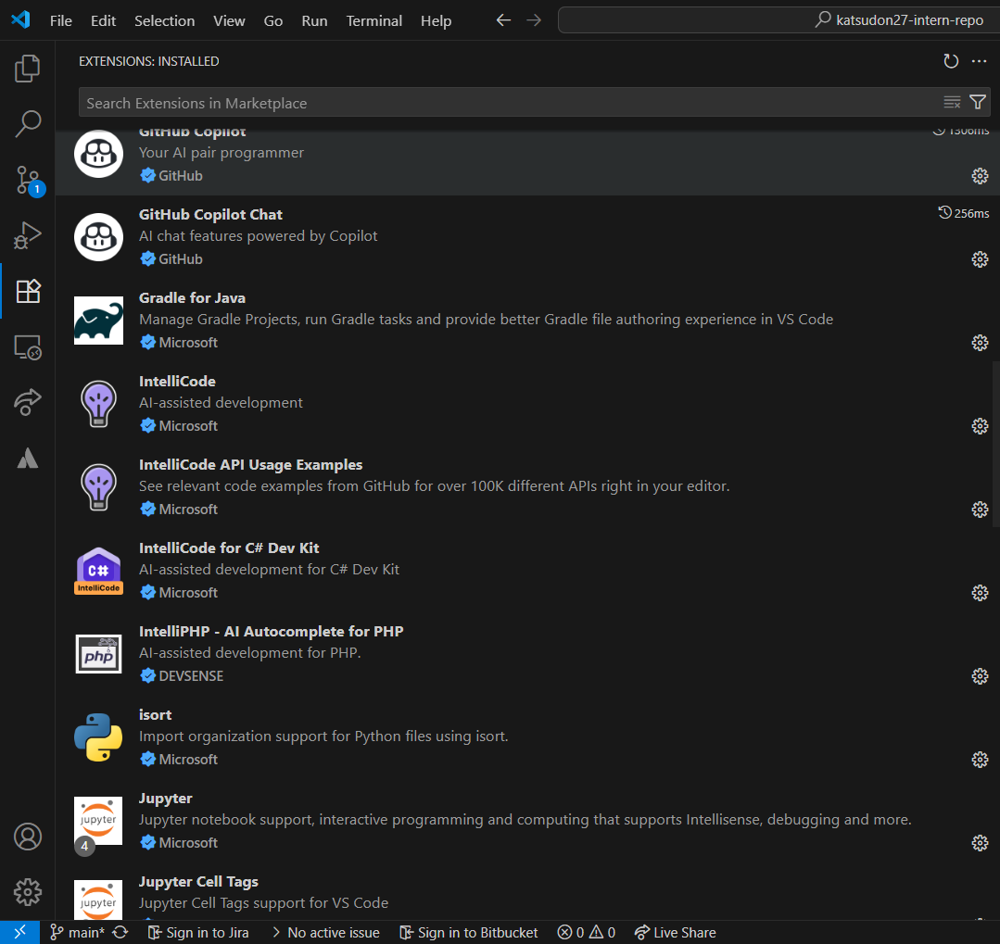

# Installing VS Code

- I have installed and set up VS Code on my local machine.

# Top 10 Shortcuts

## Navigation

1. Ctrl + P - Quick open files by name
2. Ctrl + Tab - Switch between recently used tabs
3. F12 - Go to definition

## Editing

1. Alt + Click - Add multiple cursors.
2. Ctrl + D - Select next occurrence of the current word.
3. Ctrl + Shift + L - Select all occurrences of the current selection.

## Debugging

1. F5 - Start/continue debugging.
2. F9 - Toggle breakpoint.
3. Shift + F5 - Stop debugging.

## Terminal

1. Ctrl + Shift + ` - Create a new terminal.
2. Ctrl + C - Kill the active terminal process.

# Reflection

## Which shortcuts do you think will be the most useful in your daily work?

- The multiple cursor shortcuts like Alt + Click and Ctrl + D will be the most useful for my daily work, as they allow editing repetitive code faster.
- Navigation shortcuts like Ctrl + P and Ctrl + Shift + O will also save time when jumping between files and symbols.

## How can keyboard shortcuts improve your productivity?

- Keyboard shortcuts remove the need to constantly switch between keyboard and mouse, which speeds up common actions like navigation and code editing.
- Over time, this reduces cognitive load and improves workflow efficiency, allowing me to focus more on problem-solving instead of interface interactions.
- For example, while working on a small Python project, I had a function name repeated multiple times across the same file. Using Ctrl + D, I was able to quickly select each occurrence and rename them consistently without manually searching. This saved me several minutes compared to using the mouse and search function.

## Screenshot of VS Code setup

