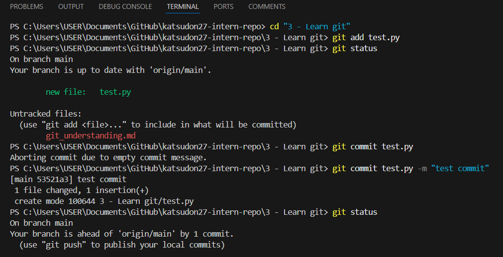
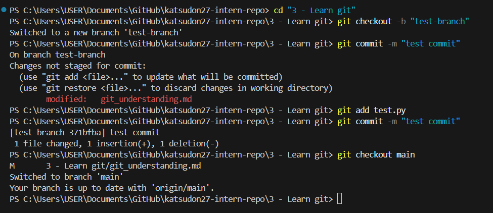

# Summary for Task #54

## What is the difference between staging and committing?
- Staging means preparing specific changes to be included in the next commit.
- On the other hand, committing means permanently recording the staged changes into the project's history with a commit message.

## Why does Git separate these two steps?
- The separation is to give developers more control and flexibility which allows them to:
    - Group related changes together into a single commit.
    - Review what is staged before finalising a commit.

## When would you want to stage changes without committing?
- When you want to save progress incrementally but are not ready to commit yet. Staging lets you mark work in progress while continuing development.
- When collaborating, you might stage parts of your work to review them before finalising a commit.

## Screenshot as evidence of experimenting with the terminal:
- I created a testing file and tried the following:
    - Stage it but don’t commit (git add <file>).
    - Check the status (git status).
    - Unstage the file (git reset HEAD <file>).
    - Commit the file (git commit -m <message>).

- 

# Reflection for Task #55

## Why is pushing directly to main problematic?
- Pushing directly to main can break the main codebase if untested or incomplete code is introduced.
- It makes it harder to review changes and can lead to bugs being deployed into production.

## How do branches help with reviewing code?
- Branches allow developers to work on features, fixes, or experiments independently without affecting the stable main branch.
- When a branch is ready, it can be reviewed through a Pull Request (PR) before merging, giving teammates the chance to check code quality, suggest improvements, and catch bugs early.
- This creates a structured workflow where code is tested and reviewed before becoming part of the main project history.

## What happens if two people edit the same file on different branches?
- Git will try to merge the changes automatically if they affect different parts of the file.
- If both branches modify the same lines of code, Git will raise a merge conflict. The team then needs to manually resolve the conflict by deciding which changes to keep.

## Branching experiment
- I created a new branch via the terminal in VS Code with "git checkout -b <branch name>"
- I made a small change to the test file and committed it in the new branch.
- I switched back to the main branch with "git checkout main" and verified that the changes are not there.
- Screenshot as evidence:
 