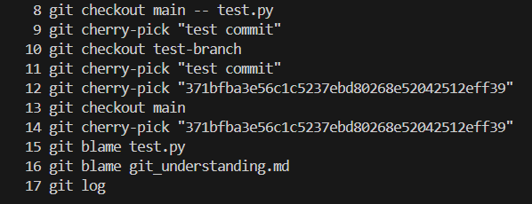
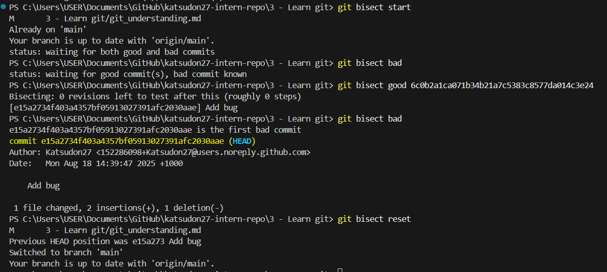
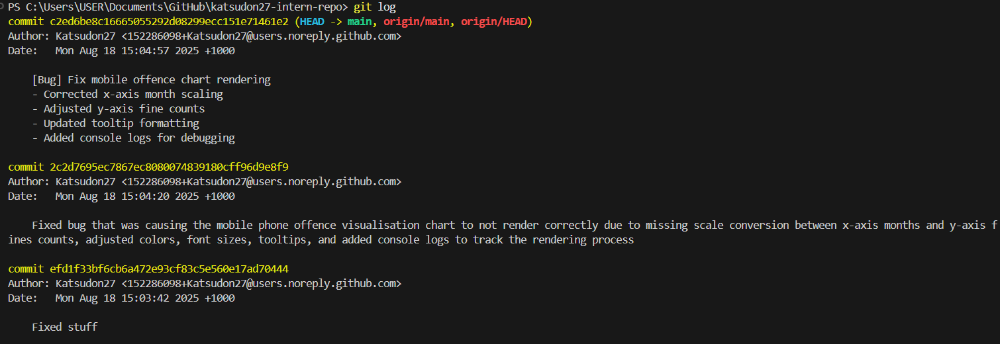

# Summary for Task #54 (Git concept: staging vs committing)

## What is the difference between staging and committing?
- Staging means preparing specific changes to be included in the next commit.
- On the other hand, committing means permanently recording the staged changes into the project's history with a commit message.

## Why does Git separate these two steps?
- The separation is to give developers more control and flexibility which allows them to:
    - Group related changes together into a single commit.
    - Review what is staged before finalising a commit.

## When would you want to stage changes without committing?
- When you want to save progress incrementally but are not ready to commit yet. Staging lets you mark work in progress while continuing development.
- When collaborating, you might stage parts of your work to review them before finalising a commit.

## Screenshot as evidence of experimenting with the terminal:
- I created a testing file and tried the following:
    - Stage it but don’t commit (git add <file>).
    - Check the status (git status).
    - Unstage the file (git reset HEAD <file>).
    - Commit the file (git commit -m <message>).

- 

# Reflection for Task #55 (Branching & Team Collaboration)

## Why is pushing directly to main problematic?
- Pushing directly to main can break the main codebase if untested or incomplete code is introduced.
- It makes it harder to review changes and can lead to bugs being deployed into production.

## How do branches help with reviewing code?
- Branches allow developers to work on features, fixes, or experiments independently without affecting the stable main branch.
- When a branch is ready, it can be reviewed through a Pull Request (PR) before merging, giving teammates the chance to check code quality, suggest improvements, and catch bugs early.
- This creates a structured workflow where code is tested and reviewed before becoming part of the main project history.

## What happens if two people edit the same file on different branches?
- Git will try to merge the changes automatically if they affect different parts of the file.
- If both branches modify the same lines of code, Git will raise a merge conflict. The team then needs to manually resolve the conflict by deciding which changes to keep.

## Branching experiment
- I created a new branch via the terminal in VS Code with "git checkout -b <branch name>"
- I made a small change to the test file and committed it in the new branch.
- I switched back to the main branch with "git checkout main" and verified that the changes are not there.
- Screenshot as evidence:

# Reflection for Task #57 (Advanced Git Commands & When to Use Them)

## Advanced Git Commands & When to Use Them
1. git checkout main -- <file>
- What it does:
    - Restores a specific file from the main branch to your current branch without affecting other changes.
- when to use it:
    - If you made changes to a file in your feature branch and want to discard those changes, but don’t want to reset the entire branch, this command restores the file to its state on main.
- Experiment reflection:
    - I modified test.py in my testing branch and ran git checkout main -- test.py. The file reverted to the version on main while other files in my branch stayed untouched.
    - Useful for undoing mistakes on specific files without affecting other work.

2. git cherry-pick <commit>
- What it does:
    - Applies a single commit from another branch onto your current branch without merging the entire branch.
- when to use it:
    - When a specific bug fix or feature commit needs to be applied to main immediately without merging the whole feature branch.
- Experiment reflection:
    - I committed a small modification to test.py on testing branch and then used the command onto the main branch. The change was applied successfully and the main branch only received that single commit.

3. git log
- What it does:
    - Displays the commit history, showing commit messages, authors, dates, and commit hashes.
- when to use it:
    - To understand the evolution of a project, track when features or fixes were introduced, or find the commit hash for cherry-picking or reverting.
- Experiment reflection:
    - Running the command helped me see all previous commits in reverse chronological order.

4. git blame <file>
- What it does:
    - Shows who last modified each line of a file and when.
- when to use it:
    - To trace responsibility for specific lines of code, understand the context of a change, or debug an issue by seeing who introduced it.
- Experiment reflection:
    - I ran the command and saw exactly which commit last changed each line.
    - This is helpful in team projects to track down changes or ask questions to the right person.

## Learnings and Surprises
- I was surprised by how the cherry-pick command uses the commit hash as I had never used it before. 
- git blame can help with accountability and understanding project history, but I realised it can be overwhelming for very large files.
- Screenshot of my command history as evidence for my experiment:

# Reflection for Task #58 (Understand git bisect)

## What does git bisect do?
- Finds the first commit that introduced a bug using binary search.

## When would you use it in a real-world debugging situation?
- Useful for long-lived repositories with hundreds of commits.
- Quickly isolates problematic code without manually reviewing every commit.

## How does it compare to manually reviewing commits?
- Manual review is slow and error-prone.
- Bisect saves time by systematically narrowing down the offending commit.

## Test Scenario
- I made a series of commits in this repository by adding new lines to test.py.
- I introduced a syntax error to the file in one of the commits.
- I used git bisect to track down the commit that caused the bug. 
- I used git bisect start and git bisect bad to mark the current commit as bad.
- I used git bisect good <commit-hash> to mark a known good commit before the bug appeared.
- I then use git bisect good or git bisect bad to mark the code as good or bad based on what I see. 
- Once I identified the bad commit, I resetted the repo with git bisect reset.
- Screenshot as evidence:

# Reflection for Task #59 (Writing Meaningful Commit Messages)

## What makes a good commit message?
- A concise summary of the change.
- Clear, readable, and actionable.
- Explains why the change was made, not just what

## How does a clear commit message help in team collaboration?
- Makes reviewing code faster.
- Helps teammates understand changes without reading all the code.
- Improves debugging and tracking history of the project.

## How can poor commit messages cause issues later?
- Hard to understand the purpose of a change.
- Difficult to track down where bugs were introduced.
- Slows down team collaboration and code reviews.

## Commit message task
- I added a commit with vague message ("Fixed stuff").
- I added a commit with overly detailed message ("Fixed bug that was causing the mobile phone offence visualisation chart to not render correctly due to missing scale conversion between x-axis months and y-axis fines counts, adjusted colors, font sizes, tooltips, and added console logs to track the rendering process").
- I added a commit with well-structured message ("[Bug] Fix mobile offence chart rendering

Corrected x-axis month scaling

Adjusted y-axis fine counts

Updated tooltip formatting

Added console logs for debugging"). 
- Screenshot as evidence from my git log:

