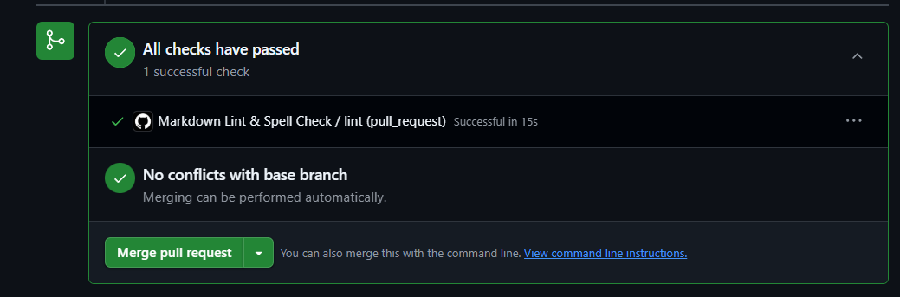

# CI/CD Reflection

## What is the purpose of CI/CD?

- CI/CD automates the integration and deployment of code changes.
- It helps detect errors early, ensures consistent quality, and allows faster, safer releases to production.

## How does automating style checks improve project quality?

- Ensures consistency in formatting and styyle across all documentation and code.
- Catches typing and formatting errors before merging PRs.
- Reduces review time for trivial style issues, allowing reviewers to focus on logic and architecture.

## What are some challenges with enforcing checks in CI/CD?

- Requires knowledge to configure pipelines correctly.
- Contributors may have different local environments, causing inconsistent results.
- Overly strict rules may slow down development or frustrate team members.

## How do CI/CD pipelines differ between small projects and large teams?

- Small projects typically use lightweight pipelines with basic linting and tests.
- Large teams typically use more sophisticated pipelines including unit, integration, and security tests; multi-stage deployment; and automated rollback mechanisms.

## CI/CD Implementation Notes

- I did some online research and managed to set up GitHub Actions workflow to run:
  - Markdown linting (`markdownlint`).
  - Spell check (`cspell`).
- Configured Husky pre-commit hook to run lint checks locally before committing.
- Tested locally by running markdownlint and cspell, and resolved all formatting and spelling issues in my Markdown files.
- Learned how to configure both tools with .yaml files:
  - Ignored specific markdown rules that were unnecessary for this project.
  - Configured cspell to allow project-specific terms.
- Opened a test PR to verify that automated checks run and block non-compliant changes.
  - Screenshot of PR passing automated checks as evidence:
  
