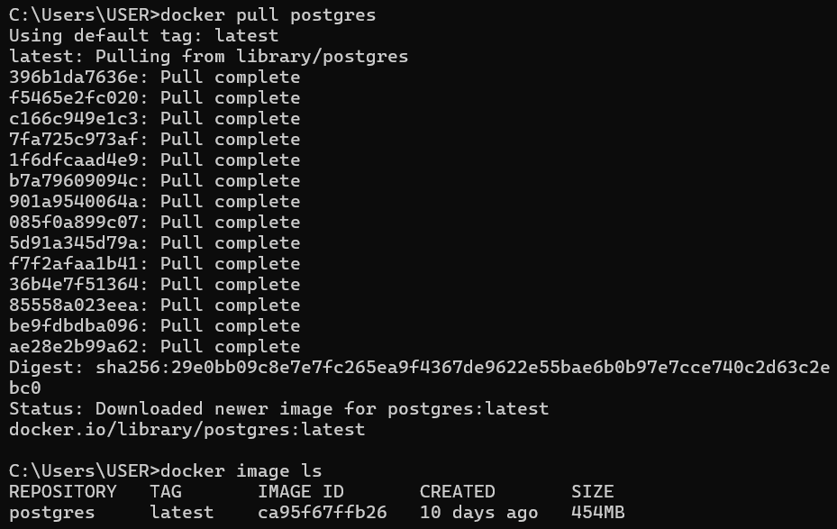
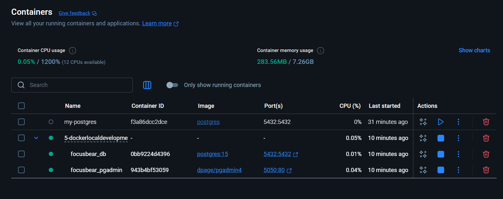
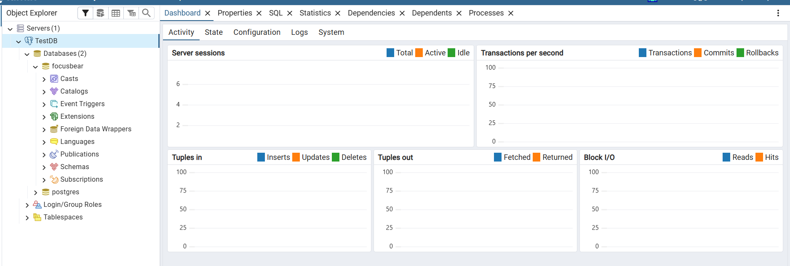

# Evidence of completeion
- I have sucessfully installed and configured PostgreSQL on my local machine using docker as shown in screenshot below:


- I have sucessfully set up a docker-compose.yml file to run PostgreSQL and pgAdmin. Screenshot below shows the docker container running both services:


- I have sucessfully connected to the PostgreSQL instance using pgAdmin. Screenshot below shows the web-based GUI of pgAdmin with the PostgreSQL instance connected:



# ✅ Reflection (docker-postgres.md)

## What are the benefits of running PostgreSQL in a Docker container?
  - Consistent setup across all developers.
  - Avoids installing PostgreSQL directly on host machine.
  - Easy to start/stop or reset the database environment.
  - Can run multiple isolated versions of PostgreSQL.

## How do Docker volumes help persist PostgreSQL data?
  - Store database files outside the container lifecycle.
  - Data remains even if the container is stopped or removed.
  - Prevents accidental data loss during container rebuilds.

## How can you connect to a running PostgreSQL container?
- Using `docker exec`
- For example:
```bash
    docker exec -it focusbear_db psql -U user -d focusbear
```


