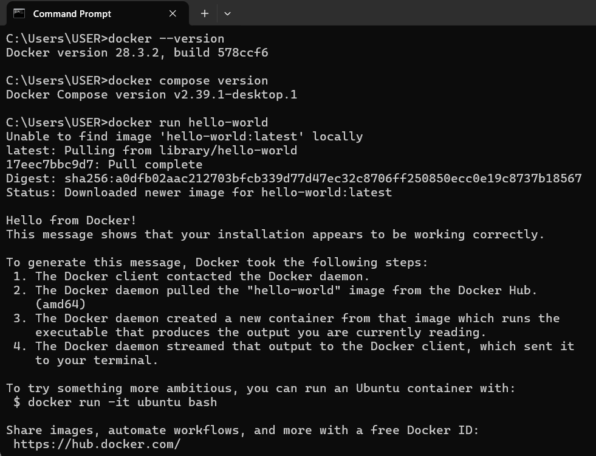

# Reflection

## What is the difference between docker run and docker-compose up?

- `docker run` starts a single container from an image whereas `docker compose up` uses a .yaml file to start multiple servcies together, thus making it easier tomanage interconnected services.

## How does Docker Compose help when working with multiple services?

- Defines all services in one configuration file.  
- Automatically links containers together
- Simplifies commands by just running `docker compose up`.  
- Easier to reproduce full backend setup across different machines.  
- Supports scaling by running multiple instances of a service.

## What commands can you use to check logs from a running container?

- `docker logs <container>` for viewing logs
- `docker logs -f <container>` for following logs in real time.
- `docker compose logs <service>` for viewing logs for a service.
- `docker compose logs -f` for following logs for all services in the stack.

## What happens when you restart a container? Does data persist?

- When you restart a container, the same image and configuration will be used.
- The data only persists if volumes are used to store data outside the container.

## Evidence of successful installation of Docker

- To verify that Docker was installed sucessfully, I ran `docker --version`, `docker compose version` and `docker run hello-world` in my terminal as shown in screenshot below:

