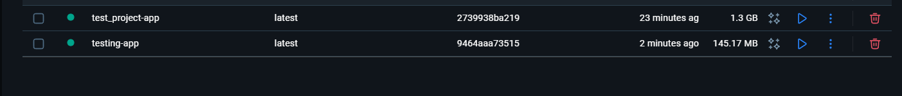
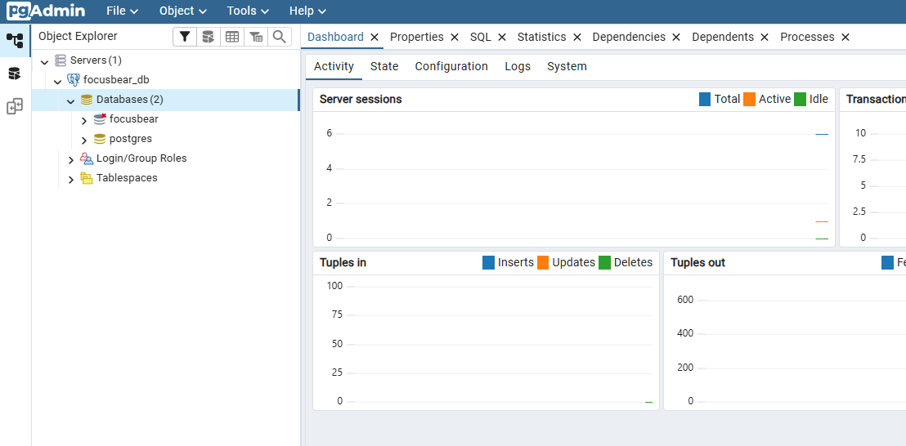

# ✅ Tasks

- I managed to create: 
  - a Dockerfile for a NestJS app
  - a Dockerfile with muli-stage build to create a smaller-sized image
  - Screenshot of both images in Docker Desktop as evidence:
  

- I managed to modify docker-compose.yml to run both the NestJS app alongside PostgreSQL and pgadmin
- I tested the setup by going to the exposed ports on my local machine's browser:
  - Screenshot of port 3000 running the Nestjs app:
  
  - Screenshot of pgadmin UI with connection to the postgresql database:
  

# ✅ Reflection (docker-nestjs.md)

## How does a Dockerfile define a containerized NestJS application?
- Specifies the environment (Node.js base image).
- Copies application source code into the container.
- Installs dependencies with npm install.
- Defines startup command (e.g., CMD ["node", "dist/main"]).

Ensures the container runs the same way across any machine.

## What is the purpose of a multi-stage build in Docker?
- A multi-stage build can help to separate the build environment from the final runtime environment, which can lead to reduced image size, improved security and faster build times.

## How does Docker Compose simplify running multiple services together?
- Allows defining multiple containers (NestJS + Postgres) in a single YAML file.
- Handles networking between services (nest can reach postgres by service name).
- Only a single command (docker-compose up) is required to start/stop everything.
- Easier to maintain than running multiple docker run commands manually.
  
## How can you expose API logs and debug a running container?
- docker logs <container_id> → view logs.
- Expose ports in docker-compose.yml (e.g., 3000:3000) to test APIs locally.