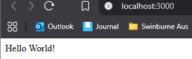

# ✅ Tasks

- I managed to generate a new controller, service and module using the CLI with the following commands:
  - ```bash nest g module users```
  - ```bash nest g service users```
  - ```bash nest g controller users```
  - Screenshot of successfully running commands with NestJS CLI:
  

# ✅ Reflection (nestjs-cli.md)

## How does the NestJS CLI help streamline development?

- Automates repetitive boilerplate code (controllers, services, modules).
- Provides a consistent folder and code structure.
- Saves time by reducing manual setup.

## What is the purpose of nest generate?

- Creates new project files (modules, services, controllers, guards, etc.) with default templates.
- Ensures each component integrates correctly into the NestJS application.

## How does using the CLI ensure consistency across the codebase?

- Follows NestJS best practices automatically.
- Prevents human error in file structure and syntax.
- Makes the codebase easier for teams to navigate and maintain.

## What types of files and templates does the CLI create by default?

- Modules → .module.ts
- Services → .service.ts, .service.spec.ts
- Controllers → .controller.ts, .controller.spec.ts
- Resources (CRUD) → module + service + controller + DTOs
- Test files for each component.
