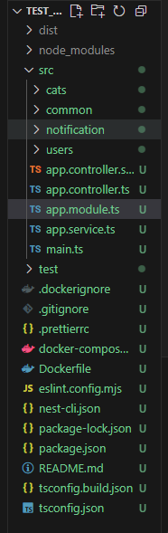

# ✅ Reflection (nestjs-intro.md)

## What are the key differences between NestJS and Express.js?

- NestJS:
  - Opinionated and enforces modular architecture. When I generated a new NestJS project using nest new project-name, I noticed a predefined folder structure (src/modules, src/controllers, src/services) which made it easy to organize features.
  - Has a strong TypeScript integration.
  - Designed for large-scale, maintainable apps. For example, the auto-generated app.module.ts shows how modules, controllers, and services are wired together automatically.
- Express.js:
  - More minimal and flexible but developer has to decide on project structure. In a small test API I created with Express, I had to manually create folders for routes and controllers.
  - Great for small APIs or prototypes.
- Example comparison: I created a simple GET /hello endpoint in both frameworks:
  - NestJS:
  ```typescript
  // hello.controller.ts
  import { Controller, Get } from '@nestjs/common';

  @Controller('hello')
  export class HelloController {
    @Get()
    getHello(): string {
      return 'Hello from NestJS!';
    }
  }
  ```
  - ExpressJS:
  ```typescript
  // app.js
  const express = require('express');
  const app = express();

  app.get('/hello', (req, res) => {
    res.send('Hello from Express!');
  });
  ```
  - This demonstrated to me how NestJS encourages modular, testable code from the start, while Express requires more manual setup.

## Why does NestJS use decorators extensively?

- To add metadata in a clear, declarative way such as defining routes and marking services.
- For example, @Controller() marks a class as a controller and @Get() marks a method as an endpoint.
- I used @Injectable() to create a service and injected it into a controller:
```typescript
import { Injectable } from '@nestjs/common';

@Injectable()
export class GreetingService {
  getGreeting(): string {
    return 'Hello NestJS!';
  }
}

// In a controller
@Controller('greet')
export class GreetingController {
  constructor(private readonly greetingService: GreetingService) {}

  @Get()
  sayHello(): string {
    return this.greetingService.getGreeting();
  }
}
```

## How does NestJS handle dependency injection?

- By automatically injecting services/providers where needed through a built-in IoC container.
- In my GreetingController example above, I did not have to manually create an instance of GreetingService; the framework handled it for me.
- This reduces boilerplate and helps avoid errors related to manually wiring services.

## What benefits does modular architecture provide in a large-scale app?

- Separation of concerns: Each module has its own controllers and services.
- Improved reusability: I was able to reuse my GreetingService in multiple controllers without duplication.
- Testability: Modules can be imported independently in unit tests.
- When exploring the NestJS docs, I saw that modules can import each other, which allows teams to work on different features independently without breaking the app.

## Personal example
While exploring NestJS for the first time, I created a small project for testing. NestJS’s decorators, modular structure, and DI container made the project much easier to navigate and extend. For example, adding a new TaskModule was as simple as generating a module with nest generate module task and wiring in the controller and service. Everything worked immediately without additional setup. See screenshot below as evidence:

