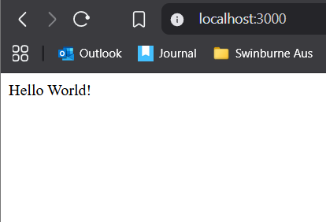

# Setting Up a NestJS Project

## Project Setup Steps

- I managed to install NestJS CLI globally: `npm install -g @nestjs/cli`.
- I created a new project: `nest new test_project`. See screenshot below as evidence of successful creation:

## Running the Development Server

- I used `npm run start:dev` to start server in watch mode.
- Server runs on `http://localhost:3000` by default.
- I tested endpoint: `GET /` and "Hello World!" was seen at the web page. See screenshot below as evidence:

---

## Reflection

- **What files are included in a default NestJS project?**
- **src/** – main source code folder.
- **main.ts** – entry point, bootstraps the application.
- **app.module.ts** – root module of the project.
- **app.controller.ts** – default controller with sample route.
- **app.service.ts** – default service providing basic logic.
- **test/** – folder for unit tests.
- **node_modules/** – installed dependencies.
- **package.json** – project metadata and scripts.
- **tsconfig.json** – TypeScript configuration.
  
- **How does main.ts bootstrap a NestJS application?**
  - Uses `NestFactory` to create the application.
  - Calls `app.listen()` to start the server.
  
- **What is the role of AppModule in the project?**
  - Serves as the root module that organises controllers and services.
  
- **How does NestJS structure help with scalability?**
  - Its modular design allows separation of features into different modules.
  - Makes it easier to maintain, extend, and test code.
