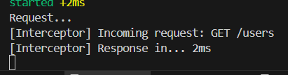

# Using Interceptors & Middleware in NestJS

## Task
- I implemented a simple logging interceptor to log request and response data such as execution time
  - Interceptor (logging.interceptor.ts)
    ```javascript
    import { CallHandler, ExecutionContext, Injectable, NestInterceptor } from '@nestjs/common';
    import { Observable, tap } from 'rxjs';

    @Injectable()
    export class LoggingInterceptor implements NestInterceptor {
        intercept(context: ExecutionContext, next: CallHandler): Observable<any> {
            const now = Date.now();
            const req = context.switchToHttp().getRequest();
            console.log(`[Interceptor] Incoming request: ${req.method} ${req.url}`);

            return next.handle().pipe(
            tap(() => console.log(`[Interceptor] Response in... ${Date.now() - now}ms`)),
            );
        }
    }
    ```
  - Modifications in users.controller.ts to use the interceptor
    ```typescript
    import { Controller, Get, Post, Put, Delete, Param, Body, UseInterceptors } from '@nestjs/common';
    import { UsersService } from './users.service';
    import { LoggingInterceptor } from 'src/common/interceptors/logging/logging.interceptor';

    @Controller('users')
    @UseInterceptors(LoggingInterceptor)
    export class UsersController {
        constructor(private readonly usersService: UsersService) {}

        @Get()
        findAll() {
            return this.usersService.findAll();
        }
    }
    ```
- I implemented a simple middleware function and applied it globally.
  - Middleware
    ```javascript
    import { Request, Response, NextFunction } from 'express';

    export function logger(req: Request, res: Response, next: NextFunction) {
        console.log(`Request...`);
        next();
    }
    ```
  - Modifications in main.ts to use the middleware globally
    ```typescript
    import { NestFactory } from '@nestjs/core';
    import { AppModule } from './app.module';
    import { logger } from './common/middleware/logging/logging.middleware';

    async function bootstrap() {
        const app = await NestFactory.create(AppModule);
        app.use(logger);
        await app.listen(process.env.PORT ?? 3000);
    }
    bootstrap();
    ```
- I used Postman to test both implementations of interceptor and middleware by sending a GET request to the server to retrieve all users:
  - Screenshot of generated logs in terminal:
    

## Reflection

### What is the difference between an interceptor and middleware in NestJS?

- Middleware runs before the controller and is good for preprocessing requests.
- Interceptors wrap around the controller, running before and after, and can also transform responses.

### When would you use an interceptor instead of middleware?

- Use an interceptor when you need to transform the response, log execution time, or apply cross-cutting concerns like caching.

### How does LoggerErrorInterceptor help?

- It automatically captures and logs detailed error information.
- This improves debugging, makes errors easier to track in production, and provides more insight into failed requests.