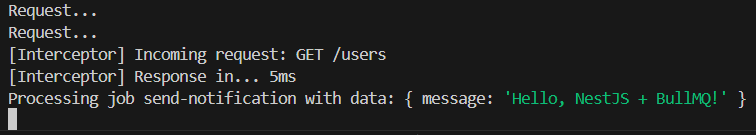

# Background Jobs with BullMQ & Redis in NestJS

## Task

- I managed to set up bullmq and @nestjs/bullmq by running "npm install bullmq @nestjs/bullmq ioredis"
- I managed to create a simple job queue that processes a notification in the background:
  - Queue module:

    ```typescript
    import { Module } from '@nestjs/common';
    import { BullModule } from '@nestjs/bullmq';
    import { NotificationQueueService } from './notification-queue.service';
    import { NotificationProcessor } from './notification.processor';

    @Module({
        imports: [
            BullModule.forRoot({
            connection: {
                host: 'localhost', // or Redis container host
                port: 6379,
            },
            }),
            BullModule.registerQueue({
            name: 'notification-queue',
            }),
        ],
        providers: [NotificationQueueService, NotificationProcessor],
        exports: [NotificationQueueService],
    })
    export class NotificationModule {}
    ```

  - Queue service:

    ```typescript
      import { Injectable } from '@nestjs/common';
      import { Queue } from 'bullmq';

      @Injectable()
      export class NotificationQueueService {
          private queue: Queue;

          constructor() {
              this.queue = new Queue('notification-queue', {
              connection: { host: 'localhost', port: 6379 },
              });
          }

          async addJob(data: any) {
              await this.queue.add('send-notification', data, {
              attempts: 3, // retry 3 times if fails
              });
          }
      }
    ```

  - Processor:

    ```typescript
    import { Processor, WorkerHost } from '@nestjs/bullmq';
    import { Job } from 'bullmq';

    @Processor('notification-queue')
    export class NotificationProcessor extends WorkerHost {
        async process(job: Job<any, any, string>) {
            console.log(`Processing job ${job.name} with data:`, job.data);
            // Example: send email or push notification
            return true;
        }
    }
    ```

  - Using the queue:

    ```typescript
    import { Injectable } from '@nestjs/common';
    import { NotificationQueueService } from './notification/notification-queue.service';

    @Injectable()
    export class AppService {
        constructor(private notificationQueue: NotificationQueueService) {}

        async sendNotification() {
            await this.notificationQueue.addJob({ message: 'Hello, NestJS + BullMQ!' });
        }
    }
    ```

- I also pulled the latest Redis image and ran a Redis server using Docker Desktop.
- I called the sendNotification() in the user.controller to process the job in the background after receiving an API request:

```typescript
  @Get()
  async findAll() {
    await this.notificationQueue.addJob({ message: 'Hello, NestJS + BullMQ!' });
    return this.usersService.findAll();
  }
```

- I tested the job queue and background task by using Postman to send an API request to the NestJS server. See screenshot below as evidence:


## Reflection

### Why is BullMQ used instead of handling tasks directly in API requests?

- Offloads long-running tasks from the main API request flow.
- Keeps endpoints fast and responsive.
- Avoids blocking other requests while background work is processed.

### How does Redis help manage job queues in BullMQ?

- Acts as an in-memory store for queued jobs.
- Tracks job status (waiting, active, completed, failed).
- Provides atomic operations and pub/sub for reliable job processing.

### What happens if a job fails? How can failed jobs be retried?

- Failed jobs are moved to a “failed” queue.
- Retry attempts can be configured per job.
- Jobs can automatically retry after a delay or on-demand.

### How does Focus Bear use BullMQ for background tasks?

- Processes time-consuming operations like sending notifications, syncing analytics, and updating user data.
- Keeps API endpoints lightweight by offloading tasks to the queue.
- Ensures reliable background processing with Redis persistence and retry mechanisms.
