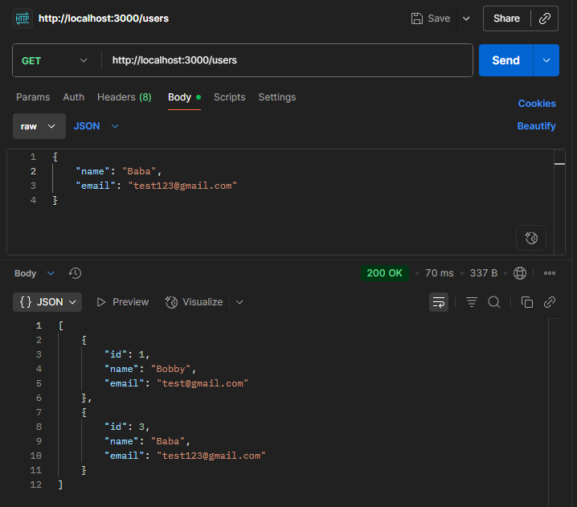
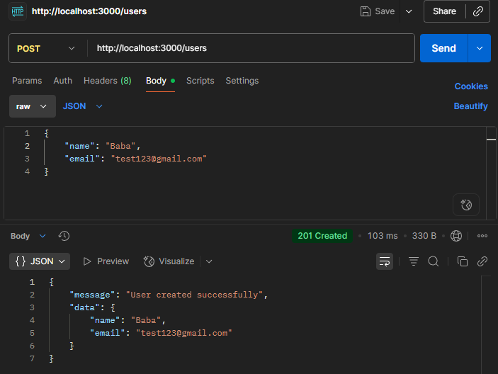
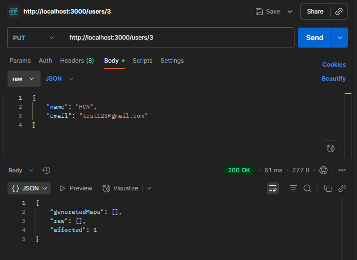
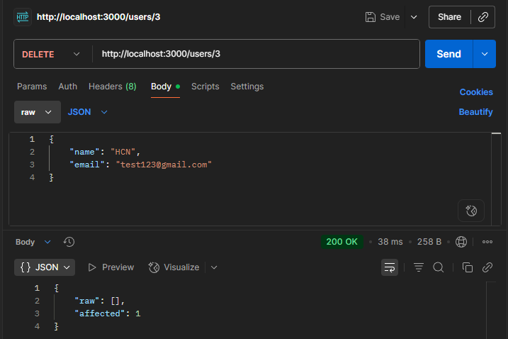

# Creating REST APIs with NestJS

## Task

- I managed to set up a database connection in NestJS using TypeORM by modifying the app.module.ts file:

    ```typescript
    import { Module } from '@nestjs/common';
    import { AppController } from './app.controller';
    import { AppService } from './app.service';
    import { UsersController } from './users/users.controller';
    import { UsersService } from './users/users.service';
    import { UsersModule } from './users/users.module';
    import { CatsController } from './cats/cats.controller';
    import { CatsService } from './cats/cats.service';
    import { CatsModule } from './cats/cats.module';
    import { TypeOrmModule } from '@nestjs/typeorm';
    import { User } from './users/user.entity';

    @Module({
        imports: [
            TypeOrmModule.forRoot({
            type: 'postgres',
            host: process.env.DB_HOST,   // 👈 from docker-compose
            port: 5432,
            username: 'user',
            password: 'password',
            database: 'focusbear',
            entities: [User],
            synchronize: true, // only for development
            }),
            TypeOrmModule.forFeature([User]),
            UsersModule, CatsModule, AppModule],
        controllers: [AppController, UsersController, CatsController],
        providers: [AppService, UsersService, CatsService],
    })
    export class AppModule {}
    ```

- I created an entity and repository to interact with PostgreSQL
  - user.entity.ts:

    ```typescript
    import { Entity, Column, PrimaryGeneratedColumn } from 'typeorm';

    @Entity()
    export class User {
        @PrimaryGeneratedColumn()
        id: number;

        @Column({ length: 50 })
        name: string;

        @Column({ unique: true })
        email: string;
    }
    ```

  - users.service.ts:

    ```typescript
    import { Injectable } from '@nestjs/common';
    import { InjectRepository } from '@nestjs/typeorm';
    import { Repository } from 'typeorm';
    import { User } from './user.entity';

    @Injectable()
    export class UsersService {
        constructor(
            @InjectRepository(User)
            private readonly userRepository: Repository<User>,
        ) {}

        // Create a new user
        createUser(name: string, email: string){
            const user = this.userRepository.create({ name, email });
            return this.userRepository.save(user);
        }

        // Get all users
        getAllUsers(){
            return this.userRepository.find();
        }

        // Update a user
        updateUser(id: number, name: string, email: string) {
            return this.userRepository.update(id, {name, email});
        }

        // Delete a user
        deleteUser(id: number){
            return this.userRepository.delete(id);
        }
    }
    ```

- I tested the endpoints on the localhost URL where the nestJS server was running using Postman to perform CRUD operations on the database. See screenshots below as evidence:
  - Sent a GET request to retrieve list of users in the database
    
  - Sent a POST request to create a new user in the database.
    
  - Sent a PUT request to update the name of user with id "3".
    
  - Sent a DELETE request to delete the user with id "3" on the database.
    

## Reflection

### How does @nestjs/typeorm simplify database interactions?

- Provides decorators and module integration with NestJS DI.
- Manages repositories automatically (no manual setup).
- Handles connection pooling/configuration inside NestJS.
  
### What is the difference between an entity and a repository in TypeORM?

- Entity is a class with fields that act as a blueprint for a table in a database.
- Repository is a service for querying or manipulating entity data in the database.
  
### How does TypeORM handle migrations in a NestJS project?

- Tracks schema changes with migration files.
- Allows safe upgrades/downgrades of DB schema.
- Ensures consistency between environments.
  
### What are the advantages of using PostgreSQL over other databases in a NestJS app?

- Strong support for relational data and constraints.
- Rich features (JSONB, indexing, transactions).
- Open-source and widely supported.
- Works seamlessly with TypeORM.
