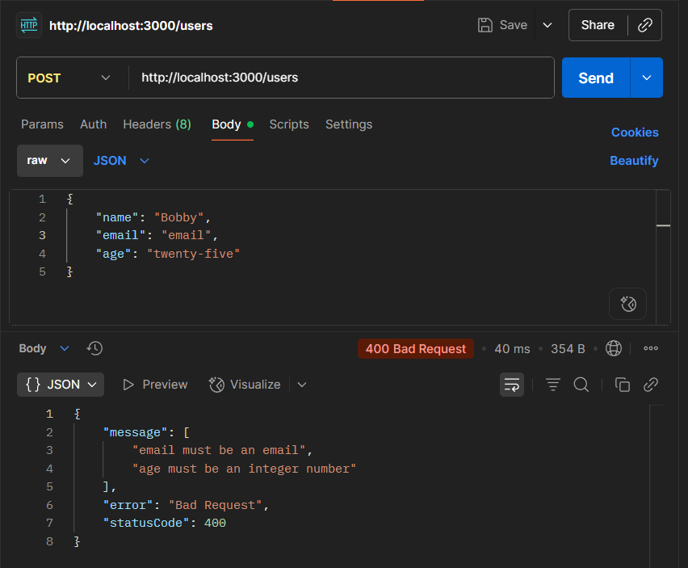
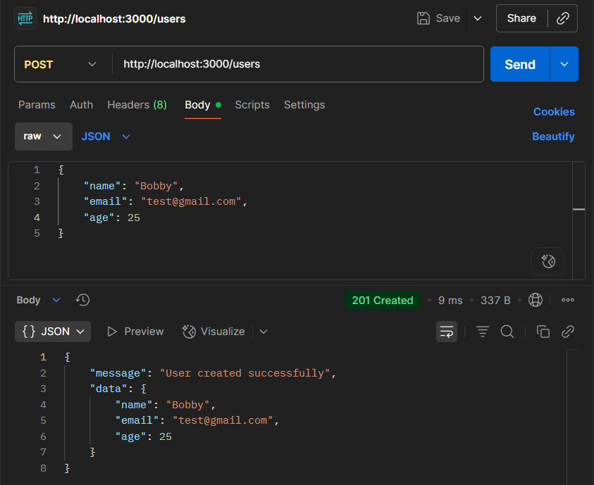

# Validating Requests with Pipes in NestJS

## Task

- I created a custom DTO with decorators from class-validator.
  - DTO for creating a user:

    ```typescript
    import { IsString, IsEmail, IsInt, MinLength } from 'class-validator';

    export class CreateUserDto {
        @IsString()
        @MinLength(3)
        name: string;

        @IsEmail()
        email: string;

        @IsInt()
        age: number;
    }
    ```

  - Using the DTO in a controller:

    ```typescript
    import { Controller, Get, Post, Put, Delete, Param, Body, UseInterceptors } from '@nestjs/common';
    import { UsersService } from './users.service';
    import { LoggingInterceptor } from 'src/common/interceptors/logging/logging.interceptor';
    import { CreateUserDto } from './dto/create-user.dto';

    @Controller('users')
    @UseInterceptors(LoggingInterceptor)
    export class UsersController {
        @Post()
        create(@Body() CreateUserDto: CreateUserDto) {
            this.usersService.create(CreateUserDto.name, CreateUserDto.email, CreateUserDto.age);
            return {
            message: 'User created successfully',
            data: CreateUserDto,
            };
        }
    }
    ```

- I used a global validation pipe to enforce DTO validation across the app in main.ts

  ```typescript
  import { NestFactory } from '@nestjs/core';
    import { AppModule } from './app.module';
    import { logger } from './common/middleware/logging/logging.middleware';
    import { ValidationPipe } from '@nestjs/common';

    async function bootstrap() {
        const app = await NestFactory.create(AppModule);
        app.use(logger);
        app.useGlobalPipes(new ValidationPipe({ whitelist: true }));
        await app.listen(process.env.PORT ?? 3000);
    }
    bootstrap();
  ```

- I tested the validation pipe by sending a POST request using Postman to create a user with both valid and invalid payloads:
  - Screenshot of response for invalid payload with wrong input types for email and age:
  
  - Screenshot of response for valid payload:
  
  
## Reflection

### What is the purpose of pipes in NestJS?

- Pipes validate and transform incoming request data before it reaches the controller.
- They ensure that only properly formatted and valid data is processed.
- They help enforce consistency and prevent runtime errors caused by invalid inputs.

### How does ValidationPipe improve API security and data integrity?

- Blocks requests with invalid or malicious data.
- Ensures controllers receive only trusted, strongly typed data.

### What is the difference between built-in and custom pipes?

- Built-in pipes: provided by NestJS (ParseIntPipe, ValidationPipe, etc.), used for common validation/transformation.
- Custom pipes: created by developers to handle specific use cases (e.g., trimming strings, custom ID checks).
  
### How do decorators like @IsString() and @IsNumber() work with DTOs?

- Each decorator defines a rule on a DTO property (e.g., must be a string, must be a number).
- ValidationPipe uses these decorators at runtime to check request data.
- If validation fails, a descriptive error response is returned automatically.
