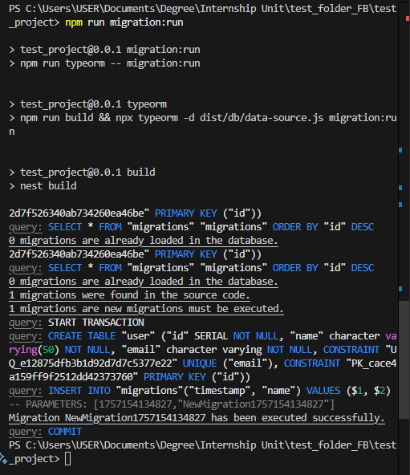
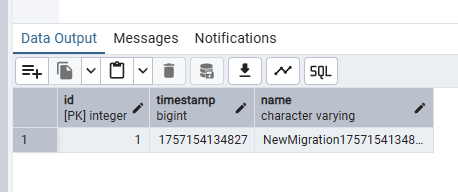
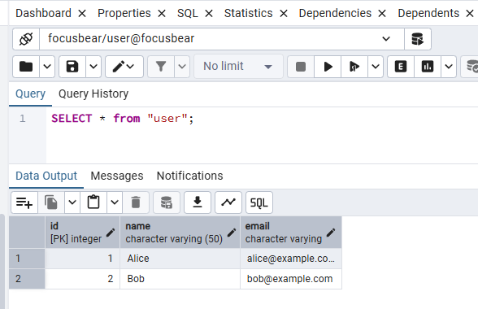
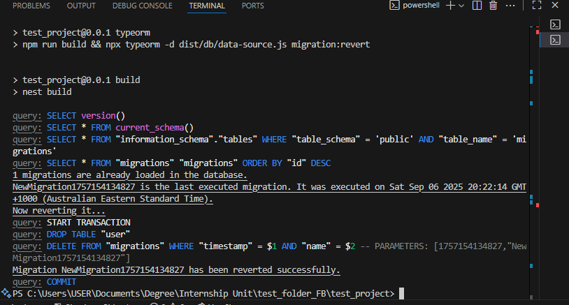
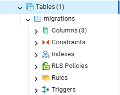

# Seeding & Migrations in TypeORM

## Task

### Creating a new migration and apply it to the database

- I created a data-source.ts in a new folder inside the root directory called "db".
```typescript
import { DataSource, DataSourceOptions } from "typeorm";

export const dataSourceOptions: DataSourceOptions = {
    type: 'postgres',
    host: 'localhost',
    port: 5432,
    database: 'focusbear',
    username: 'user',
    password: 'password',
    entities: ['dist/**/*.entity.js'],
    migrations: ['dist/db/migrations/*.js'],
    synchronize: false
}

const dataSource = new DataSource(dataSourceOptions);
export default dataSource;
```

- I made modifications to the app.module.ts file:
```typescript
import { Module } from '@nestjs/common';
import { AppController } from './app.controller';
import { AppService } from './app.service';
import { UsersModule } from './users/users.module';
import { TypeOrmModule } from '@nestjs/typeorm';
import { dataSourceOptions } from 'db/data-source';

@Module({
  imports: [TypeOrmModule.forRoot(dataSourceOptions),UsersModule],
  controllers: [AppController],
  providers: [AppService],
})
export class AppModule {}
```

- I also added the following scripts to the package.json file in my NestJS application:
```json
"typeorm": "npm run build && npx typeorm -d dist/db/data-source.js",
"migration:generate": "npm run typeorm -- migration:generate",
"migration:run": "npm run typeorm -- migration:run",
"migration:revert": "npm run typeorm -- migration:revert"
```

- I ran the postgreSQL database and pgAdmin services using Docker.
- I ran `npm run migration:generate -- db/migrations/NewMigration` using a terminal in the root directory of the NestJS application to generate a migration file as follows:
```typescript
import { MigrationInterface, QueryRunner } from "typeorm";

export class NewMigration1757154134827 implements MigrationInterface {
    name = 'NewMigration1757154134827'

    public async up(queryRunner: QueryRunner): Promise<void> {
        await queryRunner.query(`CREATE TABLE "user" ("id" SERIAL NOT NULL, "name" character varying(50) NOT NULL, "email" character varying NOT NULL, CONSTRAINT "UQ_e12875dfb3b1d92d7d7c5377e22" UNIQUE ("email"), CONSTRAINT "PK_cace4a159ff9f2512dd42373760" PRIMARY KEY ("id"))`);
    }

    public async down(queryRunner: QueryRunner): Promise<void> {
        await queryRunner.query(`DROP TABLE "user"`);
    }

}
```
- I ran `npm run migration:run` to execute the migration on the postgreSQL database.
- Screenshot of successful execution of migration in terminal:


- Screenshot of migration table in database:


### Seed sample data into PostgreSQL using TypeORM repositories

- I created seed.ts in the src folder of the project's root directory:
```typescript
import dataSource from '../db/data-source';
import { User } from './users/user.entity';

async function seed() {
  await dataSource.initialize();
  const userRepo = dataSource.getRepository(User);
  await userRepo.save([
    { name: 'Alice', email: 'alice@example.com' },
    { name: 'Bob', email: 'bob@example.com' },
  ]);
  await dataSource.destroy();
}

seed().then(() => {
  console.log('Seeding complete!');
}).catch((err) => {
  console.error('Seeding failed:', err);
});
```
- I ran the following commands to seed the sample data in the terminal:
  - `npm run build`
  - `node dist/src/seed.js`
- Screenshot of successful seeding of sample data into the users table:


### Rolling back database changes

- I ran `npm run migration:revert` to roll back the changes made to the database.
- Screenshot of successful command execution in the terminal:

- Screenshot of tables in database after rollback (users table is gone):


## Reflection

### What is the purpose of database migrations in TypeORM?

- Track and apply schema changes in a controlled, versioned manner.
- Ensure consistency across development, staging, and production.

### How do migrations differ from seeding?

- Migrations modify the database structure (tables, columns, constraints).
- Seeding inserts initial or test data into existing tables.

### Why is it important to version-control database schema changes?

- Prevent conflicts when multiple developers update the database.
- Allow safe upgrades/downgrades of production databases.
- Maintain a historical record of changes.

### How can you roll back a migration if an issue occurs?

- Use npx typeorm migration:revert to undo the last migration.
- For multiple rollbacks, revert sequentially in reverse order of application.