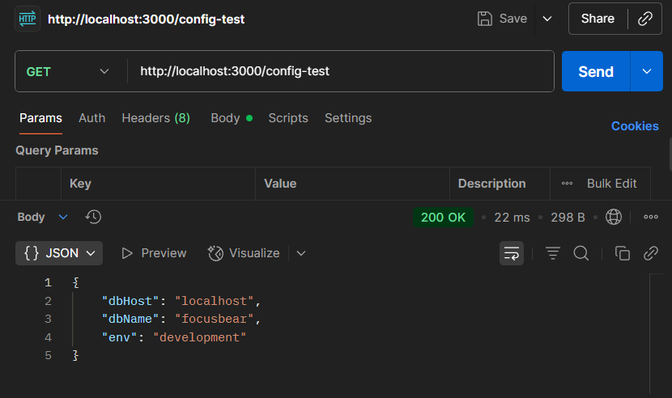

# Handling Environment Variables & Configuration in NestJS

## Task

- I managed to set up an .env file to manage environment variables securely:
`
DB_HOST=localhost
DB_PORT=5432
DB_USERNAME=user
DB_PASSWORD=password
DB_NAME=focusbear
`

- I modified the app.module.ts to use the environment variables:

```typescript
import { Module } from '@nestjs/common';
import { AppController } from './app.controller';
import { AppService } from './app.service';
import { UsersModule } from './users/users.module';
import { TypeOrmModule } from '@nestjs/typeorm';
import { ConfigModule, ConfigService } from '@nestjs/config';
import { LoggerModule } from 'nestjs-pino';
import * as Joi from 'joi';

@Module({
  imports: [
    ConfigModule.forRoot({ 
      isGlobal: true, // available everywhere
      envFilePath: `.env.${process.env.NODE_ENV || 'development'}`, // dynamic env
      validationSchema: Joi.object({
        DB_HOST: Joi.string().required(),
        DB_PORT: Joi.number().default(5432),
        DB_USERNAME: Joi.string().required(),
        DB_PASSWORD: Joi.string().required(),
        DB_NAME: Joi.string().required(),
      }),
    }),
    
    // Then configure TypeORM with env vars
    TypeOrmModule.forRootAsync({
      imports: [ConfigModule],
      inject: [ConfigService],
      useFactory: (config: ConfigService) => ({
        type: 'postgres',
        host: config.get<string>('DB_HOST', 'localhost'),
        port: config.get<number>('DB_PORT', 5432),
        database: config.get<string>('DB_NAME', 'focusbear'),
        username: config.get<string>('DB_USER', 'user'),
        password: config.get<string>('DB_PASSWORD', 'password'),
        entities: ['dist/**/*.entity.js'],
        synchronize: true,
      }),
    }),

    LoggerModule.forRoot({
        pinoHttp: {
          transport: {
            target: 'pino-pretty',
            options: {
              colorize: true,
              singleLine: true,
            },
          },
        },
    }),

    UsersModule],
  controllers: [AppController],
  providers: [AppService],
})
export class AppModule {}
```

- I added an endpoint in app.controller.ts to test the access of environment variables:

```typescript
  @Get('config-test')
  getConfig() {
    return {
      dbHost: this.configService.get<string>('DB_HOST'),
      dbName: this.configService.get<string>('DB_NAME'),
      env: process.env.NODE_ENV || 'development',
    };
  }
```

- I tested the endpoint by sending a GET request via Postman and the response showed that the config values were accessed without any issues:


## Reflection

### How does @nestjs/config help manage environment variables?

- Provides a centralised, type-safe way to access env variables.
- Allows schema validation and prevents missing/misconfigured values
- Supports multiple environment files for different environments.

### Why should secrets (e.g., API keys, database passwords) never be stored in source code?

- Prevents accidental leaks in version control.
- Reduces risk if repo is shared or compromised.
- Keeps sensitive values changeable without code changes.

### How can you validate environment variables before the app starts?

- Use Joi validation schema in ConfigModule.forRoot({ validationSchema: ... }).
- The app will crash early if required variables are missing or invalid.

### How can you separate configuration for different environments (e.g., local vs. production)?

- Use envFilePath option in ConfigModule.forRoot().
- Load .env.development when NODE_ENV=development, .env.production when in production.
- Store prod secrets in environment variables (via Docker/Kubernetes/CI), not local files.
