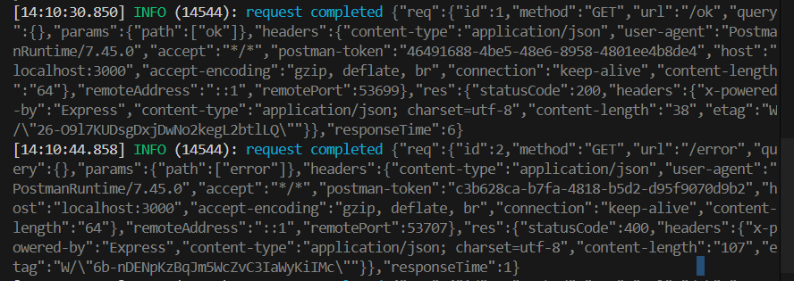
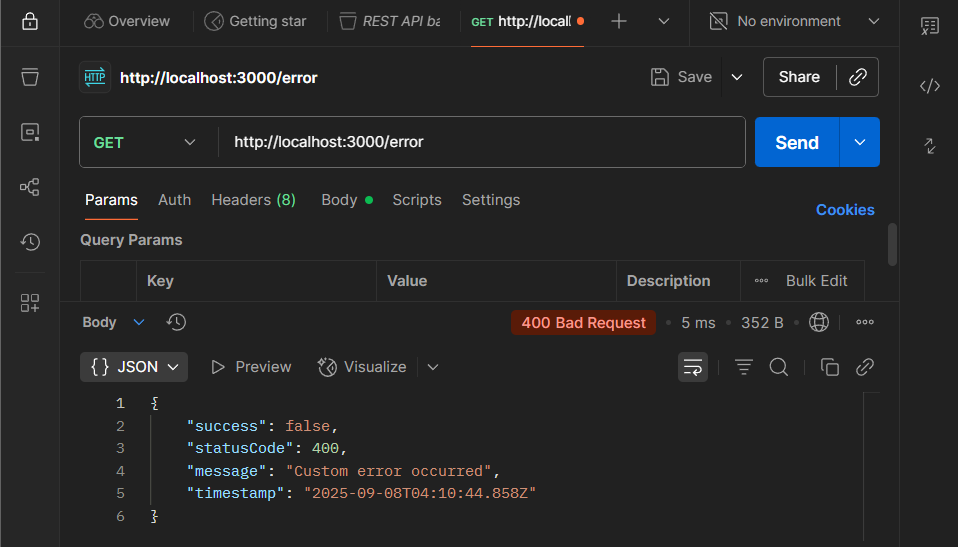

# Logging & Error Handling in NestJS

## Task

- I managed to set up structured logging with nestjs-pino by modifying the following files:
  - app.module.ts

```typescript
import { Module } from '@nestjs/common';
import { AppController } from './app.controller';
import { AppService } from './app.service';
import { UsersModule } from './users/users.module';
import { TypeOrmModule } from '@nestjs/typeorm';
import { ConfigModule, ConfigService } from '@nestjs/config';
import { LoggerModule } from 'nestjs-pino';

@Module({
    imports: [
    ConfigModule.forRoot({ isGlobal: true }),

    // Then configure TypeORM with env vars
    TypeOrmModule.forRootAsync({
        imports: [ConfigModule],
        inject: [ConfigService],
        useFactory: (config: ConfigService) => ({
        type: 'postgres',
        host: config.get<string>('DB_HOST', 'localhost'),
        port: config.get<number>('DB_PORT', 5432),
        database: config.get<string>('DB_NAME', 'focusbear'),
        username: config.get<string>('DB_USER', 'user'),
        password: config.get<string>('DB_PASSWORD', 'password'),
        entities: ['dist/**/*.entity.js'],
        synchronize: true,
        }),
    }),

    LoggerModule.forRoot({
        pinoHttp: {
            transport: {
            target: 'pino-pretty',
            options: {
                colorize: true,
                singleLine: true,
            },
            },
        },
    }),

    UsersModule],
    controllers: [AppController],
    providers: [AppService],
    })
export class AppModule {}
```

- main.ts

```typescript
import { NestFactory } from '@nestjs/core';
import { AppModule } from './app.module';
import { ValidationPipe } from '@nestjs/common';
import { Logger } from 'nestjs-pino';
import { HttpExceptionFilter } from './common/filters/http-exception.filter';

async function bootstrap() {
  const app = await NestFactory.create(AppModule, {
    bufferLogs: true,
  });
  app.useLogger(app.get(Logger));

  // Register global error filter
  app.useGlobalFilters(new HttpExceptionFilter());

  app.useGlobalPipes(new ValidationPipe({ whitelist: true }));
  await app.listen(process.env.PORT ?? 3000);
}
bootstrap();
```

- The following screenshot shows the terminal log when a request is received by the application in structured JSON:


- I implemented a custom exception filter to format API error responses (http-exception.filter.ts)

```typescript
import {
  ExceptionFilter,
  Catch,
  ArgumentsHost,
  HttpException,
  HttpStatus,
} from '@nestjs/common';
import { Response } from 'express';

@Catch()
export class HttpExceptionFilter implements ExceptionFilter {
  catch(exception: unknown, host: ArgumentsHost) {
    const ctx = host.switchToHttp();
    const response = ctx.getResponse<Response>();

    const status =
      exception instanceof HttpException
        ? exception.getStatus()
        : HttpStatus.INTERNAL_SERVER_ERROR;

    const message =
      exception instanceof HttpException
        ? exception.getResponse()
        : 'Internal server error';

    response.status(status).json({
      success: false,
      statusCode: status,
      message,
      timestamp: new Date().toISOString(),
    });
  }
}
```

- I made modifications to app.controller.ts to utilise the exception filter:

```typescript
import { Controller, Get, HttpException, HttpStatus } from '@nestjs/common';
import { AppService } from './app.service';

@Controller()
export class AppController {
  constructor(private readonly appService: AppService) {}

  @Get()
  getHello(): string {
    return this.appService.getHello();
  }

  @Get('ping')
  getPing() {
    return { message: 'pong' };
  }

  @Get('ok')
  getOk() {
    return { success: true, message: 'All good!' };
  }

  @Get('error')
  getError() {
    throw new HttpException('Custom error occurred', HttpStatus.BAD_REQUEST);
  }
}
```

- Screenshot below shows the formatted JSON error response object in Postman from the custom filter:


## Reflection

### What are the benefits of using nestjs-pino for logging?

- High-performance, JSON-based logs.
- Easy integration with log management tools.
- Provides request context automatically (method, URL, status code).

### How does global exception handling improve API consistency?

- Ensures all errors follow a standard response format.
- Prevents leaking internal error details.
- Reduces duplicated error-handling code across controllers.

### What is the difference between a logging interceptor and an exception filter?

- Logging interceptor: runs on every request/response, good for request/response timing and success logs.
- Exception filter: runs only when an error occurs, good for structured error responses and logging exceptions.

### How can logs be structured to provide useful debugging information?

- Include timestamp, log level, request method, URL, status code.
- Attach context (service/controller name).
- Include error stack traces in logs (but not in API responses).
