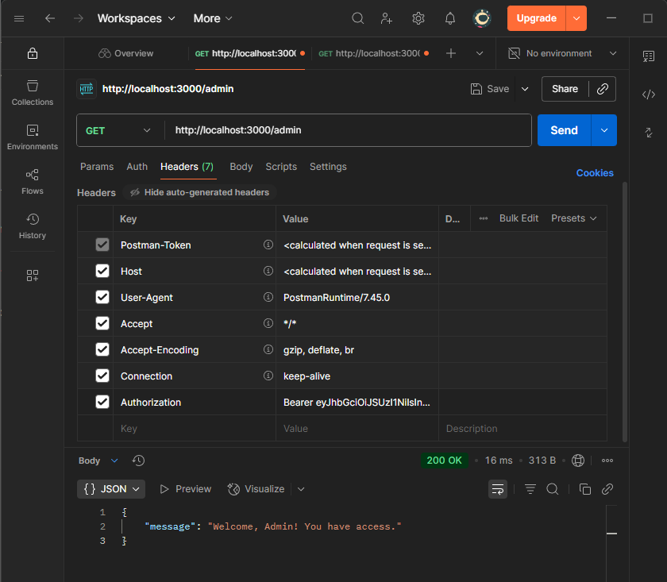

# Authentication in NestJS with Auth0 & JWT

## Task

- I managed to set up a simple authentication flow using Auth0 in a NestJS app by providing access to a specific endpoint for admin users only.
- I created a roles.decorator.ts file:

```typescript
import { SetMetadata } from '@nestjs/common';

export const ROLES_KEY = 'roles';
export const Roles = (...roles: string[]) => SetMetadata(ROLES_KEY, roles);
```

- I created a roles.guard.ts file:

```typescript
import { Injectable, CanActivate, ExecutionContext } from '@nestjs/common';
import { Reflector } from '@nestjs/core';
import * as jwt from 'jsonwebtoken';

@Injectable()
export class RolesGuard implements CanActivate {
  constructor(private reflector: Reflector) {}

  canActivate(context: ExecutionContext): boolean {
    const requiredRoles = this.reflector.get<string[]>('roles', context.getHandler());
    if (!requiredRoles || requiredRoles.length === 0){ 
      console.log("does not have roles")
      return true;}

    const request = context.switchToHttp().getRequest();
    const authHeader = request.headers.authorization;
    if (!authHeader || !authHeader.startsWith('Bearer ')) { 
      console.log("does not start with bearer")
      return false;}

    const token = authHeader.split(' ')[1];
    if (!token) { 
      console.log("cannot be split")
      return false;}

    let payload: any;
    try {
      payload = jwt.decode(token);
      console.log('Decoded payload:', payload);
      if (!payload) {
        console.log("payload is null or undefined");
        return false;
      }
    } catch (err) {
      console.log("cannot be decoded", err);
      return false;
    }

    const roles = payload['https://focusbear.com/roles'];
    if (!Array.isArray(roles)) {
      console.log("roles claim missing or not array", roles);
      return false;
    }

    return true;
  }
}
```

- - I created a admin.controller.ts file to set up custom endpoint for admin users:

```typescript
import { Controller, Get, UseGuards } from '@nestjs/common';
import { Roles } from 'src/roles/roles.decorator';
import { RolesGuard } from 'src/roles/roles.guard';

@Controller('admin')
export class AdminController {
  @Get()
  @Roles('admin')
  @UseGuards(RolesGuard)
  getAdminData() {
    return { message: 'Welcome, Admin! You have access.' };
  }
}
```

- I used the Auth0 dashboard to perform the following steps:
  - I created a Auth0 account.
  - I created a custom Action to inject roles in access tokens after a user has logged in:

  ```javascript
  exports.onExecutePostLogin = async (event, api) => {
  const assignedRoles = (event.authorization || {}).roles;

    if (assignedRoles) {
            api.accessToken.setCustomClaim(
            "https://focusbear.com/roles", // must be namespaced
            assignedRoles
            );
        }
    };
  ```

  - I deployed the custom action by attaching it to the Post Login trigger.
  - I created a role called "admin" and a sample user with the created role attached to it.
  - I created a custom API called Focusbear API and enabled RBAC settings for the API.
  - I created a sample Regular Web Applications called FocusBear Test App with the custom API attached to it.
- Using the credentials from the sample web app, I managed to log in as the sample user by browsing the following link in the web browser (https://YOUR_TENANT_DOMAIN/authorize?response_type=token&client_id=YOUR_CLIENT_IDredirect_uri=<http://localhost:3000/callbackaudience=https://focusbear/api&scope=openid> profile email)
- After successful login, I was able to retrieve the JWT access token from the embedded URL on the web browser, which was tested by decoding via jwt.io.
- To test RBAC on the Nestjs server, I used Postman to send a GET request to the created admin endpoint with an Authorization header added along with the bearer token and a success message was shown, indicating successful authentication of user:

```json
{
    "message": "Welcome, Admin! You have access."
}
```

- If the header and token were not attached as part of the GET request, the following error was shown:

```json
{
    "success": false,
    "statusCode": 403,
    "message": {
        "message": "Forbidden resource",
        "error": "Forbidden",
        "statusCode": 403
    },
    "timestamp": "2025-09-10T01:36:14.428Z"
}
```

- Screenshot of successful authentication as evidence:


## Reflection

### How does Auth0 store and manage user roles?

- Auth0 stores roles in its dashboard and assigns them to users.
- Roles can be added to access tokens as claims using Rules/Actions
- Applications read these claims to enforce authorisation.

### What is the purpose of a guard in NestJS?

- A Guard runs before a request handler.
- It determines if the request is allowed to continue.
- Guards are ideal for checking roles and permissions.

### How would you restrict access to an API endpoint based on user roles?

- Create a custom RolesGuard to check JWT claims.
- Use a @Roles() decorator on endpoints.
- Combine with JwtAuthGuard so only logged-in users with the right role can access.

### What are the security risks of improper authorization, and how can they be mitigated?

- Risks: unauthorised access, privilege escalation, data leaks.
- Mitigation: enforce RBAC consistently at the backend, validate tokens server-side, avoid relying only on client-side checks.
