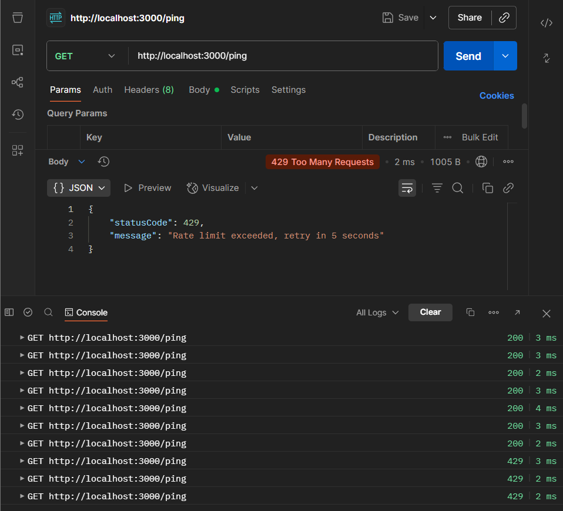

# Security Best Practices in NestJS

## Task

- I implemented request rate limiting using @fastify/rate-limit and secured HTTP headers with @fastify/helmet by modifying main.ts:

```typescript
import { NestFactory } from '@nestjs/core';
import { AppModule } from './app.module';
import { ValidationPipe } from '@nestjs/common';
import helmet from '@fastify/helmet';
import rateLimit from '@fastify/rate-limit';
import {
  FastifyAdapter,
  NestFastifyApplication,
} from '@nestjs/platform-fastify';

async function bootstrap() {
  const app = await NestFactory.create<NestFastifyApplication>(
    AppModule,
    new FastifyAdapter(),
  );

  // Security middlewares
  await app.register(helmet);
  await app.register(rateLimit, {
    max: 5,               // 5 requests
    timeWindow: '10s',    // per 10 seconds per IP
  });

  app.useGlobalPipes(new ValidationPipe({ whitelist: true }));
  await app.listen(process.env.PORT ?? 3000);
}
bootstrap();
```

- I tested the request rate limit by using Postman to spam a GET request. Screenshot below shows that the request rate limiting worked with a 429 error being received:


## Reflection

### What are the most common security vulnerabilities in a NestJS backend?

- SQL injection (malicious queries)
- Cross-Site Scripting (XSS)
- Cross-Site Request Forgery (CSRF)
- CORS misconfigurations (exposing API to unwanted origins)
- Brute force & DDoS attacks (too many requests)
- Secrets leakage (API keys, DB passwords in code)

### How does @fastify/helmet improve application security?

- Middleware that sets secure HTTP headers.
- Mitigates XSS, clickjacking, and content sniffing.
- Adds headers like Content-Security-Policy, X-Frame-Options, etc.

### Why is rate limiting important for preventing abuse?

- Throttles requests per IP.
- Prevents brute force login attempts and reduces abuse.
- Helps control server load.

### How can sensitive configuration values be protected in a production environment?

- Use .env + ConfigModule (don’t hardcode secrets).
- Never commit .env to Git.
- In production: use secret managers (AWS Secrets Manager, HashiCorp Vault, etc.).
