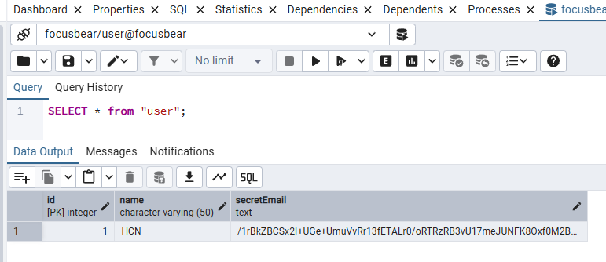
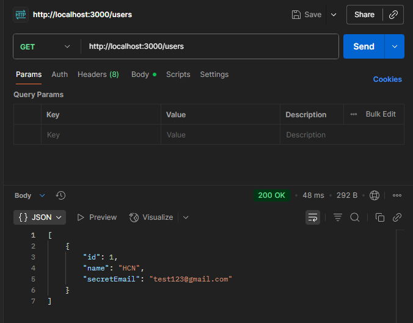

# Using typeorm-encrypted for Data Encryption

## Task

- I implemented typeorm-encrypted in user.entity.ts:

```typescript
import { Entity, Column, PrimaryGeneratedColumn } from 'typeorm';
import { EncryptionTransformer } from "typeorm-encrypted";

@Entity()
export class User {
  @PrimaryGeneratedColumn()
  id: number;

  @Column({ length: 50 })
  name: string;

  @Column({
    type: "text",
    transformer: new EncryptionTransformer({
      key: 'e41c966f21f9e1577802463f8924e6a3fe3e9751f201304213b2f845d8841d61',
      algorithm: 'aes-256-cbc',
      ivLength: 16,
      iv: 'ff5ac19190424b1d88f9419ef949ae56'
    }),
  })
  secretEmail: string;
}
```

- I tested the encryption of the database field by sending a POST request to add a new entry to the user table. Screenshot belows shows the added entry with the secretEmail field encrypted:


- I tested the decryption of the database field by sending a GET request to retrieve all entries of the user table. Screenshot belows shows the added entry with the secretEmail field decrypted:


## Reflection

### Why does Focus Bear double encrypt sensitive data instead of relying on database encryption alone?

- Database encryption at rest only protects files on disk.
- If the DB is breached or a dump is leaked, data is exposed.
- Field-level encryption ensures sensitive values remain unreadable without the app’s key.

### How does typeorm-encrypted integrate with TypeORM entities?

- It uses a transformer on entity columns.
- Encrypts data automatically when saving.
- Decrypts data automatically when fetching.

### What are the best practices for securely managing encryption keys?

- Store keys in environment variables or a secrets manager.
- Never commit keys into source control.
- Rotate keys regularly.
- Use different keys per environment (dev, staging, prod).

### What are the trade-offs between encrypting at the database level vs. the application level?

- DB-level (at rest): Easy, transparent, supports indexing, but useless if DB is compromised.
- App-level (typeorm-encrypted): Protects individual fields, survives DB leaks, but can’t be queried/indexed efficiently and adds CPU overhead.
