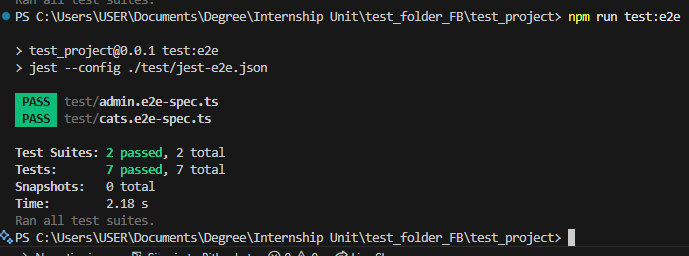

# Using Jest & Supertest for API Testing in NestJS

## Task

- I created integration tests for a simple GET API endpoint and a simple POST API endpoint (cats.e2e-spec.ts)

```ts
import request from 'supertest';
import { Test } from '@nestjs/testing';
import { INestApplication, ValidationPipe} from '@nestjs/common';
import {CatsModule} from '../src/cats/cats.module';

describe('Cats API (e2e)', () => {
  let app: INestApplication;

  beforeAll(async () => {
    const moduleRef = await Test.createTestingModule({
        imports: [CatsModule],
    }).compile();

    app = moduleRef.createNestApplication();
    app.useGlobalPipes(new ValidationPipe());
    await app.init();
  });

  describe('GET /cats', () => {
    it('should return all cats (200)', async () => {
      const res = await request(app.getHttpServer()).get('/cats').expect(200);
      expect(res.body[0]).toHaveProperty('name');
    });
  });

  describe('POST /cats', () => {
    it('should create a cat (201)', async () => {
      const payload = { name: 'Bob'};
      const res = await request(app.getHttpServer())
        .post('/cats')
        .send(payload)
        .expect(201);
    });

    it('should fail with invalid data (400)', async () => {
      await request(app.getHttpServer())
        .post('/cats')
        .send({ foo: 'bar' })
        .expect(400);
    });
  });

    afterAll(async () => {
    await app.close();
  });
});
```

- I mocked authentication in API tests by providing test JWTs (admin.e2e-spec.ts)

```ts
import { Test } from '@nestjs/testing';
import { INestApplication, ExecutionContext, CanActivate, UnauthorizedException, ForbiddenException } from '@nestjs/common';
import request from 'supertest';
import * as jwt from 'jsonwebtoken';
import { AdminController } from '../src/admin/admin.controller';
import { RolesGuard } from '../src/roles/roles.guard';

const TEST_SECRET = 'test-secret';

// Mock RolesGuard to handle both auth and role check for test
class MockRolesGuard implements CanActivate {
  canActivate(context: ExecutionContext): boolean {
    const req = context.switchToHttp().getRequest();
    const auth = req.headers['authorization'];
    if (!auth || !auth.startsWith('Bearer ')) {
      throw new UnauthorizedException();
    }
    const token = auth.split(' ')[1];
    try {
      const payload = jwt.verify(token, TEST_SECRET);
      req.user = payload;
      const roles = payload['https://focusbear.com/roles'] || [];
      if (roles.includes('admin')) {
        return true;
      }
      throw new ForbiddenException();
    } catch {
      throw new UnauthorizedException();
    }
  }
}

describe('AdminController (e2e, JWT mock)', () => {
  let app: INestApplication;

  beforeAll(async () => {
    const moduleRef = await Test.createTestingModule({
      controllers: [AdminController],
    })
      .overrideGuard(RolesGuard)
      .useClass(MockRolesGuard)
      .compile();

    app = moduleRef.createNestApplication();
    await app.init();
  });

  afterAll(async () => {
    await app.close();
  });

  it('should allow access with a valid admin JWT', async () => {
    const token = jwt.sign(
      { sub: 1, 'https://focusbear.com/roles': ['admin'] },
      TEST_SECRET,
      { expiresIn: '1h' }
    );

    const res = await request(app.getHttpServer())
      .get('/admin')
      .set('Authorization', `Bearer ${token}`)
      .expect(200);

    expect(res.body).toEqual({ message: 'Welcome, Admin! You have access.' });
  });

  it('should reject requests without a token', async () => {
    await request(app.getHttpServer())
      .get('/admin')
      .expect(401);
  });

  it('should reject requests with an invalid token', async () => {
    const badToken = jwt.sign(
      { sub: 2, 'https://focusbear.com/roles': ['admin'] },
      'wrong-secret'
    );
    await request(app.getHttpServer())
      .get('/admin')
      .set('Authorization', `Bearer ${badToken}`)
      .expect(401);
  });

  it('should reject requests with a non-admin JWT', async () => {
    const token = jwt.sign(
      { sub: 3, 'https://focusbear.com/roles': ['user'] },
      TEST_SECRET,
      { expiresIn: '1h' }
    );
    await request(app.getHttpServer())
      .get('/admin')
      .set('Authorization', `Bearer ${token}`)
      .expect(401);
  });
});
```

- Screenshot below shows the tests successfuly executed in the terminal:


## Reflection

### How does Supertest help test API endpoints?

- Allows you to send HTTP requests directly to your NestJS server without starting it on a real port.
- Tests the full request–response cycle, including routing, controllers, pipes, and middleware.

### What is the difference between unit tests and API tests?

- Unit tests isolate a single class or function (e.g., a service method).
- API/integration tests exercise multiple layers together via real HTTP calls.

### Why should authentication be mocked in integration tests?

- Prevents dependency on a real identity provider.
- Keeps tests fast, deterministic, and independent of token expiration or network issues.

### How can you structure API tests to cover both success and failure cases?

- Group tests per endpoint with `describe`.
- For each group, add:
  - A test for successful use case with valid input
  - One or more tests with errors such as invalid input or missing token
