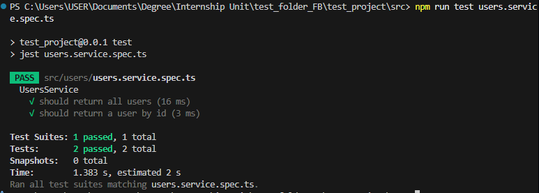
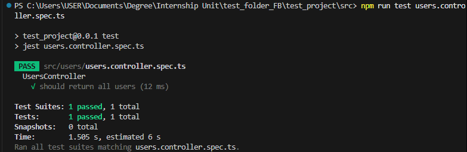

# 📌 Mocking Dependencies & Database Interactions in NestJS

## Task
- I used jest.fn() to mock a service inside a controller test (users.controller.spec.ts)
  
```ts
import { Test, TestingModule } from '@nestjs/testing';
import { UsersController } from './users.controller';
import { UsersService } from './users.service';

describe('UsersController', () => {
  let controller: UsersController;
  const mockUsersService = {
    findAll: jest.fn().mockResolvedValue([{ id: 1, name: 'Alice', email: 'alice@gmail.com' }])
  };

  beforeEach(async () => {
    const module: TestingModule = await Test.createTestingModule({
      controllers: [UsersController],
      providers: [{provide: UsersService, useValue: mockUsersService}]
    }).compile();

    controller = module.get<UsersController>(UsersController);
  });

  it('should return all users', async () => {
    await expect(controller.findAll()).resolves.toEqual([{ id: 1, name: 'Alice',  email: 'alice@gmail.com' }]);
    expect(mockUsersService.findAll).toHaveBeenCalled();
  });
});

```

- I used jest.fn() to mock a database repository (TypeORM Repository) in a service test (users.service.spec.ts):

```ts
import { Test, TestingModule } from '@nestjs/testing';
import { UsersService } from './users.service';
import { getRepositoryToken } from '@nestjs/typeorm';
import { User } from './user.entity';

describe('UsersService', () => {
  let service: UsersService;

  // create a fake/mock repository
  const mockUserRepository = {
    find: jest.fn().mockResolvedValue([{ id: 1, name: 'Alice', email: 'alice@gmail.com' }]),
    save: jest.fn(),
    findOneBy: jest.fn().mockImplementation((criteria) =>
      Promise.resolve({ id: criteria.id, name: 'Mock User', email: 'mock@gmail.com' })),
    update: jest.fn(),
    delete: jest.fn(),
    // add other methods your service calls
  };

  beforeEach(async () => {
    const module: TestingModule = await Test.createTestingModule({
      providers: [
        UsersService,
        { provide: getRepositoryToken(User), useValue: mockUserRepository }, // 👈 provide the mock
      ],
    }).compile();

    service = module.get<UsersService>(UsersService);
  });

  it('should return all users', async () => {
    expect(await service.findAll()).toEqual([{ id: 1, name: 'Alice', email: 'alice@gmail.com' }]);
    expect(mockUserRepository.find).toHaveBeenCalled();
  });

  it('should return a user by id', async () => {
    expect(await service.findOne(99)).toEqual({ id: 99, name: 'Mock User', email: 'mock@gmail.com' });
    expect(mockUserRepository.findOneBy).toHaveBeenCalledWith({ id: 99 });
  });
});
```

- To run the unit test for users.service, I ran the command `npm run test users.service.spec.ts` in the terminal. The screenshot below shows the code passing all of the tests:


- To run the unit test for users.controller, I ran the command `npm run test users.controller.spec.ts` in the terminal. The screenshot below shows the code passing all of the tests:


## Reflections

### Why is mocking important in unit tests?

- Speeds up tests.
- Makes tests deterministic and isolated.
- Allows testing error scenarios or edge cases.

### How do you mock a NestJS provider (e.g., a service in a controller test)?

- Use `Test.createTestingModule({ controllers: [...], providers: [{ provide: Service, useValue: mockService }] })`.
- Replace methods with jest.fn() to control return values

### What are the benefits of mocking the database instead of using a real one?

- Tests run faster, without needing a database setup.
- Avoids side effects on real data.
- Can simulate rare scenarios like failed queries.

### How do you decide what to mock vs. what to test directly?

- Mock anything external to the unit under test.
- Test the logic of the unit itself without mocking.
- Avoid over-mocking; mocks should represent realistic behavior.
