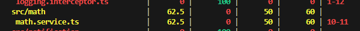

# Understanding the Focus Bear Coverage Bar & Writing Meaningful Tests

## Task
- I created a math.service.ts for testing purposes by running `nest g service math`.
```ts
import { Injectable } from '@nestjs/common';

@Injectable()
export class MathService {
  add(a: number, b: number): number {
    return a + b;
  }

  divide(a: number, b: number): number {
    if (b === 0) throw new Error('Division by zero');
    return a / b;
  }
}
```

- The command also generated a math.service.spec.ts file with a weak test that expects the service to be defined:
```ts
import { Test, TestingModule } from '@nestjs/testing';
import { MathService } from './math.service';

describe('MathService', () => {
  let service: MathService;

  beforeEach(async () => {
    const module: TestingModule = await Test.createTestingModule({
      providers: [MathService],
    }).compile();

    service = module.get<MathService>(MathService);
  });

  it('should be defined', () => {
    expect(service).toBeDefined();
  });
});
```

- I managed to run a test suite and generate a test coverage report using `npm run test:cov math.service.spec.ts`:


- The initial coverage report only met 62.5% of test coverage, thus I made modifications to math.service.spec.ts to add more tests and ensure each of them have proper assertions:
```ts
import { MathService } from './math.service';

describe('MathService (good)', () => {
  let service: MathService;

  beforeEach(() => {
    service = new MathService();
  });

  it('should add two numbers', () => {
    expect(service.add(2, 3)).toBe(5);
  });

  it('should divide numbers', () => {
    expect(service.divide(10, 2)).toBe(5);
  });

  it('should throw on divide by zero', () => {
    expect(() => service.divide(5, 0)).toThrow('Division by zero');
  });
});
```

- After running the command again, the coverage report indicated that the test coverage had reached 100%:


## Reflection
### What does the coverage bar track, and why is it important?

- It shows what percentage of statements, branches, functions, and lines are executed by tests, which are important to help spot untested code.

### Why does Focus Bear enforce a minimum test coverage threshold?

- To ensure every feature is tested enough to catch regressions before deployment.

### How can high test coverage still lead to untested functionality?

- If tests don’t assert behavior (e.g., only calling a method without checking its result), code may run but not be verified.

### What are examples of weak vs. strong test assertions?

- Weak: expect(service).toBeDefined().
- Strong: expect(await service.findOne(1)).toEqual({ id:1, name:'Alice' }).

### How can you balance increasing coverage with writing effective tests?

- Prioritise important paths first, cover both success failure cases, and always include assertions for outcomes.
