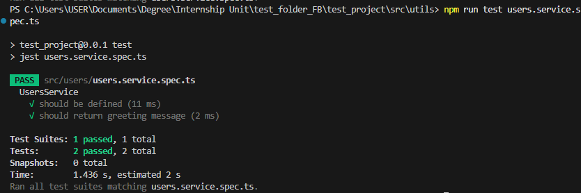

# Introduction to Testing in NestJS

## Task

- I added a simple method to users.service.ts:

```typescript
import { Injectable } from '@nestjs/common';
import { InjectRepository } from '@nestjs/typeorm';
import { Repository } from 'typeorm';
import { User } from './user.entity';

@Injectable()
export class UsersService {
  constructor(
    @InjectRepository(User)
    private readonly userRepository: Repository<User>,
  ) {}

  // Create a new user
  createUser(name: string, email: string){
    const user = this.userRepository.create({ name, secretEmail: email });
    return this.userRepository.save(user);
  }

  getHello(): string{
    return "Hello from UsersService!";
  }
}
```

- I created a simple test using Jest by modifying users.service.spec.ts

```ts
import { Test, TestingModule } from '@nestjs/testing';
import { UsersService } from './users.service';
import { getRepositoryToken } from '@nestjs/typeorm';
import { User } from './user.entity';

describe('UsersService', () => {
  let service: UsersService;

  // create a fake/mock repository
  const mockUserRepository = {
    find: jest.fn(),
    save: jest.fn(),
    findOneBy: jest.fn(),
    update: jest.fn(),
    delete: jest.fn(),
    // add other methods your service calls
  };

  beforeEach(async () => {
    const module: TestingModule = await Test.createTestingModule({
      providers: [
        UsersService,
        { provide: getRepositoryToken(User), useValue: mockUserRepository }, // 👈 provide the mock
      ],
    }).compile();

    service = module.get<UsersService>(UsersService);
  });

  it('should be defined', () => {
    expect(service).toBeDefined();
  });

  it('should return greeting message', () => {
    expect(service.getHello()).toBe('Hello from UsersService!');
  });
});
```

- I ran the test using Jest by typing the command `npm run test users.service.spec.ts` into the terminal. The screenshot below shows the code passing the tests successfully:


## Reflection

### What are the key differences between unit, integration, and E2E tests?

- Unit: Smallest scope, tests one service/controller in isolation.
- Integration: Ensures multiple components work together correctly.
- E2E: Tests the full app, mimicking real-world API calls.

### Why is testing important for a NestJS backend?

- Ensures APIs are reliable and bug-free.
- Prevents regressions when adding/changing features.
- Builds confidence in deploying updates.
- Improves maintainability and scalability

### How does NestJS use @nestjs/testing to simplify testing?

- Provides a testing module that mimics the real app module.
- Lets you inject controllers/services without bootstrapping the whole app.
- Makes mocking dependencies easier.

### What are the challenges of writing tests for a NestJS application?

- Setting up dependencies and mocks for complex modules.
- Handling async code (e.g., database queries).
- Ensuring tests don’t become too slow with E2E.
- Keeping tests updated as the app evolves.
