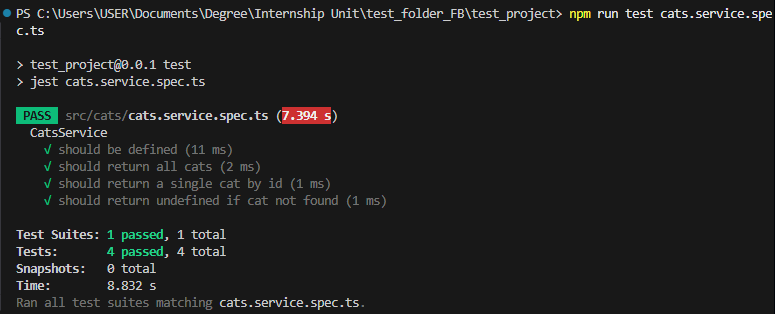
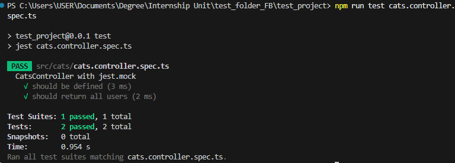

# Writing Unit Tests for Services & Controllers in NestJS

## Task

- I created a simple NestJS service called cats.service.ts:

```ts
import { Injectable } from '@nestjs/common';

@Injectable()
export class CatsService {
    private cats = [{id: 1, name:"Alice"}];

    findAll(){
        return this.cats;
    }

    findOne(id: number){
        return this.cats.find(cat => cat.id === id);
    }
}
```

- I created a simple NestJS controller called cats.controller.ts:

```ts
import { Controller, Get, Param } from '@nestjs/common';
import { CatsService } from './cats.service';

@Controller('cats')
export class CatsController {
    constructor (private readonly catsService: CatsService) {}

    @Get()
    getCats(){
        return this.catsService.findAll();
    }

    @Get(':id')
    getCat(@Param('id') id: string){
        return this.catsService.findOne(Number(id));
    }
}
```

- I created wrote a unit test for cats.service by modifying cats.service.spec.ts:

```ts
import { Test, TestingModule } from '@nestjs/testing';
import { CatsService } from './cats.service';

describe('CatsService', () => {
  let service: CatsService;

  beforeEach(async () => {
    const module: TestingModule = await Test.createTestingModule({
      providers: [CatsService],
    }).compile();

    service = module.get<CatsService>(CatsService);
  });

  it('should be defined', () => {
    expect(service).toBeDefined();
  });

  it('should return all cats', () => {
    expect(service.findAll()).toEqual([{ id: 1, name: 'Alice' }]);
  });

  it('should return a single cat by id', () => {
    expect(service.findOne(1)).toEqual({ id: 1, name: 'Alice' });
  });

  it('should return undefined if cat not found', () => {
    expect(service.findOne(99)).toBeUndefined();
  });
});
```

- I created wrote a unit test for cats.controller by modifying cats.service.spec.ts and using jest.mock:

```ts
import { CatsController } from './cats.controller';
import { CatsService } from './cats.service';

// 👇 Mock the whole UsersService class
jest.mock('./cats.service');

describe('CatsController with jest.mock', () => {
  let controller: CatsController;
  let service: jest.Mocked<CatsService>;

  beforeEach(() => {
    service = new CatsService() as jest.Mocked<CatsService>;
    controller = new CatsController(service);
  });

  it('should be defined', () => {
    expect(controller).toBeDefined();
  });

  it('should return all users', () => {
    // define the mock return value
    service.findAll.mockReturnValue([{ id: 99, name: 'Mock User' }]);

    expect(controller.getCats()).toEqual([{ id: 99, name: 'Mock User' }]);
    expect(service.findAll).toHaveBeenCalled();
  });
});
```

- To run the unit test for cats.service, I ran the command `npm run test cats.service.spec.ts` in the terminal. The screenshot below shows the code passing all of the tests:


- To run the unit test for cats.controller, I ran the command `npm run test cats.controller.spec.ts` in the terminal. The screenshot below shows the code passing all of the tests:


## Reflection

### Why is it important to test services separately from controllers?

- Services hold business logic, therefore should be tested independently to ensure correctness.
- Controllers should only be tested for response handling.
- Prevents duplication of tests and isolates errors faster.

### How does mocking dependencies improve unit testing?

- Removes reliance on database or external services.
- Makes tests faster and more reliable.
- Lets you control edge cases (e.g., service returning empty data).

### What are common pitfalls when writing unit tests in NestJS?

- Forgetting to mock dependencies → Nest can’t resolve providers.
- Writing integration tests instead of unit tests by accident.
- Not testing edge cases (null, empty arrays, errors).
- Over-mocking (tests don’t reflect real usage).

### How can you ensure that unit tests cover all edge cases?

- Think of normal, boundary, and failure scenarios.
- Use Jest matchers like toThrow, toBeNull, toEqual([]).
- Use code coverage (npm run test:cov) to identify untested paths.
