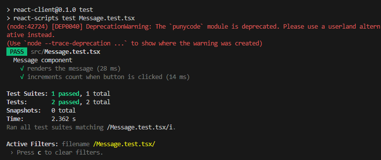

# Unit Tests

## 73 - Introduction to Unit Testing with Jest

### Task

- I created a utility function that adds two numbers:

```js
// utils/add.js
function add(a, b) {
  return a + b;
}
module.exports = add;
```

- I created a test for the utility function:

```js
// utils/add.test.js
const add = require('./add');

test('adds two numbers correctly', () => {
  expect(add(2, 3)).toBe(5);
});

test('adds negative numbers correctly', () => {
  expect(add(-2, -3)).toBe(-5);
});
```

- I ran the test and verified that it passes:

- I pushed the test to the GitHub repo of my test application:
<https://github.com/Katsudon27/focusbear_test_project/commit/1f3ccabb7c16c1d8366e281c9be0f3be04d6fb58>

### Reflections

#### Why is automated testing important in software development?

- Ensures new changes don’t break existing features (prevents regressions).
- Increases confidence when deploying updates.
- Saves time by catching bugs early.
- Improves code maintainability and reliability.

#### What did you find challenging when writing your first Jest test?

- Understanding how to structure the test syntax (test, expect, matchers).
- Remembering how Jest automatically finds test files.
- For example, when I first installed Jest in my repo, I had to configure package.json so that Jest targets both js and ts files.

## 75 - Mocking API Calls in Jest

### Task

- I created a React component that fetches and displays data from an API (CatList.tsx):

```ts
import React, { useEffect, useState } from 'react';
import axios from 'axios';

interface Cat {
  id: number;
  name: string;
}

export function CatList() {
  const [cats, setCats] = useState<Cat[]>([]);
  const [loading, setLoading] = useState(true);

  useEffect(() => {
    axios.get<Cat[]>('/api/cats').then(response => {
      setCats(response.data);
      setLoading(false);
    });
  }, []);

  if (loading) return <p>Loading...</p>;

  return (
    <ul>
      {cats.map(c => (
        <li key={c.id}>{c.name}</li>
      ))}
    </ul>
  );
}
```

- I created a Jest test that mocks the API call and verifies the component' behaviour (CatList.test.tsx):

```ts
// CatList.test.tsx
jest.mock('axios', () => ({
  get: jest.fn(),
}));

import { render, screen, waitFor } from '@testing-library/react';
import axios from 'axios';
import { CatList } from './CatList';

const mockedAxios = axios as jest.Mocked<typeof axios>;

describe('CatList component', () => {
  it('renders cats from API', async () => {
    // Arrange: mock API response
    mockedAxios.get.mockResolvedValueOnce({
      data: [{ id: 1, name: 'Alice' }, { id: 2, name: 'Bob' }],
    });

    render(<CatList />);

    // Assert: loading state first
    expect(screen.getByText(/Loading.../i)).toBeInTheDocument();

    // Wait until cats appear
    await waitFor(() => {
      expect(screen.getByText('Alice')).toBeInTheDocument();
      expect(screen.getByText('Bob')).toBeInTheDocument();
    });
  });
});
```

- To run the test, I ran the command `npm test CatList.test.tsx` in the terminal. The screenshot below shows the component passing the unit test:


- I pushed the test to my GitHub repository which can be found here:
<https://github.com/Katsudon27/focusbear_test_project/commit/2170ea1d7e83bbda444a78da36e7537a3b0ad001>

### Reflection

#### Why is it important to mock API calls in tests?

- Avoids slow/unreliable external calls.
- Lets you control API responses for predictable tests.
- Allows simulation of errors (e.g., 500 error, network failure).
- Ensures tests only validate component logic, not the API itself.

#### What are some common pitfalls when testing asynchronous code?

- Forgetting to await async functions.
- Not mocking rejected promises which leads unhandled errors in tests.
- Over-mocking with tests that don’t reflect real behavior.
- Using real APIs by accident resulting in flaky tests.

## 74 - Testing React Components with Jest & React Testing Library

### Task

- I created a simple React component that displays a message and the number of clicks for a button (Message.tsx):

```ts
import React, { useState } from 'react';

export function Message() {
  const [count, setCount] = useState(0);

  return (
    <div>
      <p>Hello, user!</p>
      <p>Button clicked: {count} times</p>
      <button onClick={() => setCount(count + 1)}>Click me</button>
    </div>
  );
}
```

- I created tests that checks if the component renders the message correctly and simulates user interaction of clicking the rendered button (Message.test.tsx):

```ts
import React from 'react';
import { render, screen, fireEvent } from '@testing-library/react';
import { Message } from './Message';

describe('Message component', () => {
  it('renders the message', () => {
    render(<Message />);
    expect(screen.getByText(/Hello, user!/i)).toBeInTheDocument();
    expect(screen.getByText(/Button clicked: 0 times/i)).toBeInTheDocument();
  });

  it('increments count when button is clicked', () => {
    render(<Message />);
    const button = screen.getByText(/Click me/i);

    fireEvent.click(button);
    expect(screen.getByText(/Button clicked: 1 times/i)).toBeInTheDocument();

    fireEvent.click(button);
    expect(screen.getByText(/Button clicked: 2 times/i)).toBeInTheDocument();
  });
});
```

- To run the test, I ran the command `npm test Message.test.tsx` in the terminal. The screenshot below shows the component passing the unit test:


- I pushed the test to my GitHub repository which can be found here:
[<https://github.com/Katsudon27/focusbear_test_project/commit/2170ea1d7e83bbda444a78da36e7537a3b0ad001>](https://github.com/Katsudon27/focusbear_test_project/commits/master/)

### Reflection

#### What are the benefits of using React Testing Library instead of testing implementation details?

- Tests focus on what the user sees/interacts with, not internal state.
- Less brittle as refactoring internals doesn’t break tests.
- Encourages accessibility through queries like getByRole and getByLabelText.

#### What challenges did you encounter when simulating user interaction?

- Some events (like input typing) require fireEvent.change or userEvent.type.
- Selecting elements correctly using queries (getByText, getByRole) can be tricky.
- For example in Message.test.tsx, I had to be really careful to specify the text that would in theory be displayed when the button is clicked.
