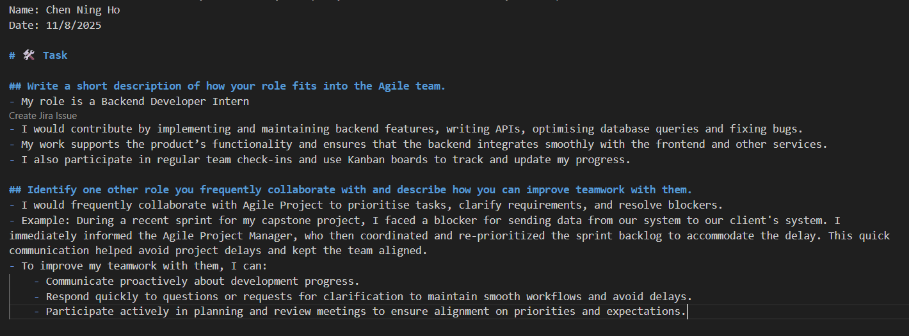

Name: Chen Ning Ho
Date: 11/8/2025

# 🛠️ Task

## Write a short description of how your role fits into the Agile team.
- My role is a Backend Developer Intern
- I would contribute by implementing and maintaining backend features, writing APIs, optimising database queries and fixing bugs.
- My work supports the product’s functionality and ensures that the backend integrates smoothly with the frontend and other services.
- I also participate in regular team check-ins and use Kanban boards to track and update my progress.

## Identify one other role you frequently collaborate with and describe how you can improve teamwork with them.
- I would frequently collaborate with Agile Project to prioritise tasks, clarify requirements, and resolve blockers.
- Example: During a recent sprint for my capstone project, I faced a blocker for sending data from our system to our client's system. I immediately informed the Agile Project Manager, who then coordinated and re-prioritized the sprint backlog to accommodate the delay. This quick communication helped avoid project delays and kept the team aligned.
- To improve my teamwork with them, I can:
    - Communicate proactively about development progress.
    - Respond quickly to questions or requests for clarification to maintain smooth workflows and avoid delays.
    - Participate actively in planning and review meetings to ensure alignment on priorities and expectations.

## Screenshot of Agile-Roles.md file with name and date:
 