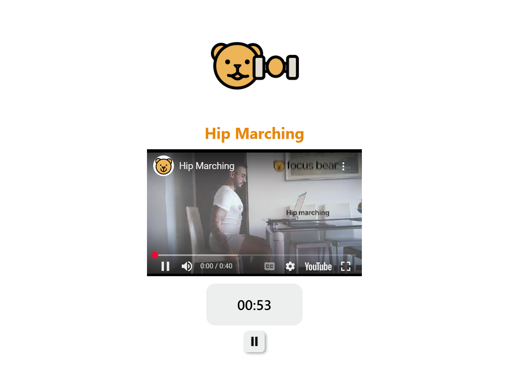

# 📝 Reflection

## What equipment changes can you make to improve your workspace setup? (e.g., using an external monitor, adjusting your chair, using a laptop stand)
- I can use an external monitor and position it at eye level to reduce neck strain.
- I can use an external keyboard and mouse to keep my wrists in a neutral position.
- I can adjust my chair height to make sure my feet stays flat on the floor and knees are at a 90 degrees angle.

## What behavioural changes can you implement to improve posture and reduce strain? (e.g., sitting upright, taking regular breaks, adjusting screen height)
- Take 5–10 minute movement breaks every hour to stretch and walk.
- Sit upright and avoid leaning towards the screen.

## How can you remind yourself to maintain good posture and take breaks throughout the day? (Hint: Use Focus Bear to schedule movement breaks!)
- Use Focus Bear's micro break feature and follow the provided videos to do stretches and maintain posture.

# 🛠️ Task

## Adjust your laptop setup based on ergonomic best practices.
- I moved my external monitor's height to be at eye level.

## Identify at least one piece of equipment that could improve your posture and comfort.
- An external keyboard
- A mouse
- Ergonomic chair

## Try using posture and movement reminders for a full workday and note any improvements. (Hint: Focus Bear has built-in reminders for movement breaks!)
- I used the micro break feature in Focus Bear to schedule posture and movement reminders every 20 minutes.
- I would follow along the provided videos to do stretches such as upper chest stretches and hip marches. The screenshot below shows the Hip Marches video that is shown during one of the micro breaks that I followed while using Focus Bear.
- Screenshot as evidence:
 

## Document at least one workspace change or habit adjustment you made.
- I started using Focus Bear's micro break and timer features to remind myself to stand up, do some stretchings or walk after working for a period of time. 